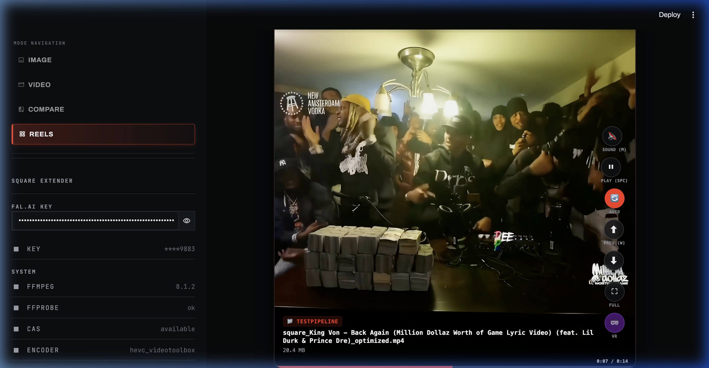

# Square Extender 4K

Converts images and videos into a **1:1 square 4K master (3840×3840)** by generatively outpainting padding via [fal.ai](https://fal.ai) and upscaling locally with hardware-accelerated **FFmpeg** or **VapourSynth**, featuring an integrated **WebXR 4K Reels Player** optimized for **Meta Quest 3**.

```
UPLOAD (Single / Batch)  →  CONFIGURE (Outpaint & Upscale)  →  ESTIMATE COST  →  RESULT (4K Master)  →  REELS (WebVR)
```

---

## Visual Showcase

### Image Processing & Multi-File Batch Mode


### Video Processing, Bytedance Upscaler & Live Cost Breakdown


### WebXR 4K Master Reels Player (Meta Quest 3 / WebVR)


### Interactive Render Comparison


---

## Key Features

- ⚡ **Multi-Item Batch Upload**: Drop single or multiple images (`PNG`, `JPG`, `WEBP`) or videos (`MP4`, `MOV`, `AVI`, `WEBM`) at once.
- 🥽 **WebXR 4K Master Reels Player (Meta Quest 3)**:
  - **Hardware HEVC Acceleration**: Native 4K HEVC playback on Quest 3 Snapdragon XR2 Gen 2.
  - **IMAX Curved Screen Arc**: Authentic YouTube VR-style curved 3D quad geometry (`ARC_ANGLE = 0.6 rad`).
  - **6DOF Natural Grab & Level Horizon**: Hold grip button to drag/reposition video screen; screen auto-aligns level to viewer POV with 0 sideways roll.
  - **Interactive 3D Transport Panel**: Floating 2D canvas controls panel in 3D VR space with Play/Pause, Seek, Mute, Curve, and `🔄 AUTO` / `🔁 LOOP` playback mode toggles.
  - **Background Preloader**: Pre-buffers next track for zero-latency reel transitions.
- 💰 **Live Pre-Render Cloud Cost Estimator**: Real-time billing breakdown panel displayed before render, calculating effective video duration, outpaint stage costs, and upscale stage costs.
- 🚀 **Bytedance Video Upscaler Cloud Model**:
  - Model ID: `fal-ai/bytedance-upscaler/upscale/video`
  - Configurable target resolution (`1080p`, `2k`, `4k`), FPS (`30fps`, `60fps`), quality tier (`fast`, `standard`, `pro`), scenario presets (`general`, `ugc`, `short_series`, `aigc`, `old_film`), and fidelity (`medium`, `high`).
- 🎬 **Optimized 4K HEVC Master Video Encoding**:
  - Hardware-accelerated local HEVC encoding (`hevc_videotoolbox` / `hevc_nvenc` / `libx265`).
  - Capped 14M/16M VBR bitrate ceiling to prevent network buffer starvation on VR headsets.
  - `-movflags +faststart` MOOV header placement for instant frame 1 pre-roll streaming.
- 🎨 **Dual Pipeline Modes**:
  - **OUTPAINT + UPSCALE**: Generatively extends short edges via `fal.ai` cloud models (LTX 2.3 Quality, Luma Ray-2 Reframe, Kling Video) before upscaling.
  - **UPSCALE ONLY**: Runs 100% locally with zero cloud API keys required.
- 🔍 **System Diagnostic & Self-Healing**: Auto-locates `ffmpeg`, `ffprobe`, `vspipe`, and HEVC hardware encoders across system PATHs and virtual environments.

---

## Quick Start

### 1. Requirements

- **Python 3.10 to 3.12+**
- **FFmpeg & FFprobe** (installed on system or PATH)

### 2. Environment Setup

```bash
# Clone repository
git clone https://github.com/LeDHoang/videoextendersquare.git
cd videoextendersquare

# Create virtual environment & install dependencies
python -m venv .venv
source .venv/bin/activate      # On Windows: .venv\Scripts\activate
pip install -r requirements.txt
```

### 3. API Key Configuration

Create a `.env` file from `.env.example`:

```env
FAL_KEY=your_fal_ai_api_key_here
```

> **Note**: `FAL_KEY` is only required for generative outpainting and cloud upscaling. **UPSCALE ONLY (FAST / STUDIO)** mode runs entirely offline.

### 4. Launch Web Application

```bash
streamlit run app.py
```

Open **http://localhost:8501** in your browser.

---

## Meta Quest 3 WebXR Testing Setup

WebXR requires a **Secure Context** (`https://` or `localhost`).

1. Connect Meta Quest 3 to your Mac via USB-C.
2. Open Chrome on Mac and go to `chrome://inspect/#devices`.
3. Click **Port forwarding...** and add:
   - `8501` → `localhost:8501` (Streamlit Web App)
   - `8502` → `localhost:8502` (Media Server)
4. On Meta Quest 3 Browser, navigate to: `http://localhost:8501/reels`.
5. Click **"Enter VR 🥽"** to launch the immersive 4K VR Reels session!

---

## Architecture

```
app.py                  Streamlit entrypoint: layout, navigation, environment setup
.streamlit/config.toml  Native dark theme tokens & web fonts
docs/images/            Documentation UI screenshots
pipeline/               Core processing workers (thread-isolated)
├─ image_worker.py      fal.ai flux outpaint + FFmpeg Lanczos4 upscale
├─ video_worker.py      fal.ai (LTX / Luma / Kling outpaint + Bytedance / SeedVR2 upscale) + local HEVC master
└─ utils.py             Geometry, padding math & execution logger
ui/                     Editorial UI & state engine
├─ views/               image_view, video_view, reels_view, compare_view
├─ assets/              reels.html, webxr_vr.js, app.css
├─ runner.py            Thread pool manager with live progress streaming & queuing
├─ health.py            System PATH self-heal & hardware probes
├─ media.py             Session staging, web proxies & result persistence
└─ mediaserver.py       High-performance HTTP 206 range server (port 8502)
```

---

## License

MIT License. Built for high-performance video and image transformation workflows.
