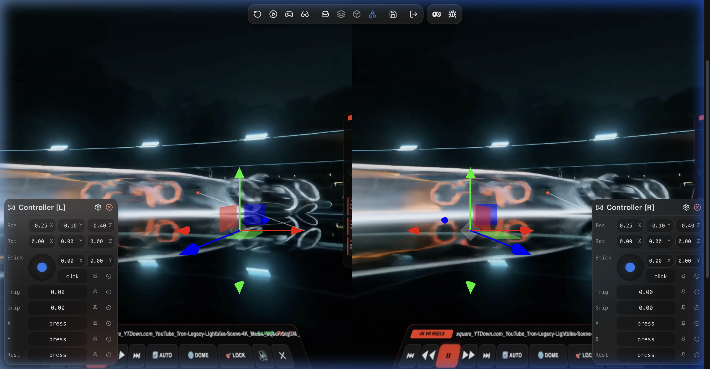

# ECHO — 4K Square Spatial Video Extender & WebXR VR Player (v2.0)

<p align="center">
  
</p>

<p align="center">
  <strong>Generative 1:1 Square Outpainting · 4K HEVC Spatial Master Encoding · WebXR Immersive Cosmic VR Reels</strong>
</p>

---

## Visual Showcase

### 1. Image Extender & Multi-File Batch Mode
Generatively extend canvas borders to 1:1 square (3840×3840) with instant padding metrics and multi-model cloud / offline upscalers.


### 2. Video Extender & Live Cost Breakdown
Full outpaint + upscale pipeline featuring Bytedance Video Upscaler, LTX 2.3, Luma Ray-2, local HEVC master encoding, and live pre-render billing estimator.


### 3. WebXR 4K Reels Player (Desktop Viewport with Dynamic Glow)
Ultra-smooth 1:1 square reels player with synchronized dynamic ambient glow (Ambilight), instant folder / codec switching, and search filtering.


### 4. WebXR Immersive Cosmic VR Mode (Meta Quest 3 / Vision Pro)
Step inside an atmospheric midnight-blue cosmos with 1,800 breathing stars, real-time radiant video glow, 6DOF natural grab-and-drag, and 3D floating spatial transport panel.


### 5. Fast vs Studio Render Comparison Inspector
Interactive side-by-side A/B slider comparing Lanczos4+CAS against ZNEDI3 neural interpolation with automatic proxy streaming.


---

## Key Features

### 🥽 WebXR 4K Master Reels Player (Meta Quest 3 & Apple Vision Pro)
- **Deep Midnight-Blue Cosmic Skybox**: Surrounds the viewer with 1,800 procedurally placed stars with multi-harmonic harmonic twinkling and additive alpha blending.
- **Dynamic Real-Time Ambilight Aura**: Synchronized Gaussian glow backing on 2D desktop browsers and GLSL fragment glow shader in WebXR stereo VR.
- **All-Side 3D Curvature Screen Modes**:
  - **`🌐 DOME` (Concave Hemisphere)**: Curves symmetrically toward the viewer in a true 3D spherical dome cap with direct center focal apex $(0,0,0)$.
  - **`🔲 SQ CURVE` (Concave Square)**: Dual-axis curvature along both $X$ and $Y$ dimensions while preserving sharp rectangular framing.
  - **`📺 FLAT`**: Planar display mode.
- **6DOF Natural Grab & Level Horizon**: Hold the Quest grip button to freely drag and position the video screen anywhere in 3D space with zero roll disorientation.
- **Floating 3D Spatial Transport Panel**: Seek, Play/Pause, Mute, Volume, Curvature Toggle, and `🔄 AUTO` / `🔁 LOOP` modes rendered in 3D space.
- **Zero-Latency Video Preloader**: Proactively pre-buffers the next track for instantaneous reel transitions.

### 🎨 Generative 1:1 Square Outpainting & 4K Encoding
- **Dual Pipeline Modes**:
  - **OUTPAINT + UPSCALE**: Generatively extends portrait/landscape videos to 1:1 square via `fal.ai` models (LTX 2.3, Luma Ray-2, Kling Video) before upscaling.
  - **UPSCALE ONLY**: Runs 100% locally with zero cloud API keys required.
- **Bytedance Video Upscaler Integration**:
  - Model ID: `fal-ai/bytedance-upscaler/upscale/video`
  - Custom target resolution (`1080p`, `2k`, `4k`), frame rate (`30fps`, `60fps`), quality tier, scenario presets, and fidelity settings.
- **Local Hardware HEVC Master Encoding**:
  - Hardware acceleration (`hevc_videotoolbox` on macOS / `hevc_nvenc` on NVIDIA / `libx265`).
  - Bitrate ceiling optimization to guarantee smooth Quest 3 decoding without buffer drops.
  - `-movflags +faststart` MOOV header atom placement for instant frame-1 streaming.

### ⚡ Modern Single Page Application Architecture (v2.0)
- **React 19 + Vite 6 Frontend**: Cyberpunk brutalist dark mode design system with Tron-inspired **Orbitron** typography, unified 38px controls, and glassmorphism.
- **FastAPI Asynchronous Backend**: Non-blocking REST endpoints, Server-Sent Events (SSE) live job progress streaming, and HTTP 206 Partial Content video range serving.

---

## Quick Start

### 1. Prerequisites
- **Node.js 18+** & **npm**
- **Python 3.10 to 3.12+**
- **FFmpeg & FFprobe** installed and available in your PATH

### 2. Installation

```bash
# Clone the repository
git clone https://github.com/LeDHoang/videoextendersquare.git
cd videoextendersquare

# Set up Python virtual environment
python -m venv .venv
source .venv/bin/activate    # On Windows: .venv\Scripts\activate
pip install -r requirements.txt

# Install frontend dependencies
cd web
npm install
cd ..
```

### 3. Configuration
Create a `.env` file in the project root:

```env
FAL_KEY=your_fal_ai_api_key_here
```
*(Note: `FAL_KEY` is only required for generative outpainting and cloud upscaling. Local FAST/STUDIO modes run completely offline.)*

### Social beta setup

Copy the environment template and configure account security before launching:

```bash
cp .env.example .env
```

At minimum, replace `SX_SECURITY_SECRET`. Set `SX_COOKIE_SECURE=1` when the site is served over HTTPS. Enable `SX_TRUST_PROXY_HEADERS=1` only when a trusted reverse proxy overwrites `X-Forwarded-For`. Configure `SX_ADMIN_USERS` or `SX_MODERATOR_USERS` with comma-separated usernames/emails for the moderation queue.

Password reset email requires `SX_PUBLIC_URL`, `SX_SMTP_HOST`, `SX_SMTP_FROM`, and the matching SMTP port/credentials. `SX_PASSWORD_RESET_EXPOSE_TOKEN=1` is for local development only.

Apply the database schema before starting the backend:

```bash
make migrate
```

For a database created by the older automatic `create_all()` startup path, back it up first. Only when the old social tables already exist and `alembic_version` does not, mark that known baseline and then upgrade:

```bash
cp data/echo.db data/echo.db.backup
.venv/bin/python -m alembic stamp 20260910_0001
make migrate
```

Do not stamp a blank or partially created database; use `make migrate` directly instead.

Install and run the automated profile/safety checks with:

```bash
make install-dev
make test
```


### 4. Running the Application

In terminal 1 (FastAPI Backend):
```bash
.venv/bin/uvicorn server.app:app --host 127.0.0.1 --port 8000 --reload
```

In terminal 2 (Vite Frontend):
```bash
cd web
npm run dev
```

Open **http://localhost:5173** in your browser.

---

## Meta Quest 3 WebXR Testing Setup

WebXR requires a **Secure Context** (`https://` or `localhost`).

1. Connect your Meta Quest 3 to your Mac / PC via USB-C cable.
2. Open Chrome and navigate to `chrome://inspect/#devices`.
3. Click **Port forwarding...** and add:
   - `5173` → `localhost:5173` (Vite Frontend)
   - `8000` → `localhost:8000` (FastAPI Server)
4. On your Meta Quest Browser, navigate to: `http://localhost:5173/reels`.
5. Click **"VR MODE 🥽"** on screen to enter the cosmic WebXR immersive player!

---

## Project Structure

```
videoextendersquare/
├── web/                    # Modern React 19 + Vite 6 SPA
│   ├── src/
│   │   ├── pages/          # ImagePage, VideoPage, ReelsPage, ComparePage
│   │   ├── components/     # UI primitives, controls, Sidebar, Nav, ReelsPlayer
│   │   ├── styles/         # Design tokens (tokens.css) & global styles (global.css)
│   │   └── api/            # REST & SSE streaming client
│   └── public/             # Logo emblem, icons, and static assets
├── server/                 # High-performance FastAPI backend
│   ├── app.py              # Application lifecycle & middleware
│   ├── routers/            # image.py, video.py, reels.py, compare.py, config.py
│   ├── media.py            # H.264 proxy transcoding & pair scanning
│   └── jobs.py             # Asynchronous task runner with SSE broadcast
├── pipeline/               # Core media transformation workers
│   ├── image_worker.py     # Flux outpainting & Lanczos4 / FAL upscaling
│   ├── video_worker.py     # Video outpainting (LTX/Luma/Kling) & HEVC encoding
│   └── utils.py            # Geometric padding math & FFmpeg probing
├── ui/assets/              # WebGL & WebXR shaders (webxr_vr.js, reels.html, compare.html)
└── docs/images/            # High-resolution documentation screenshots
```

---

## License

MIT License. Designed and built for high-performance generative spatial video transformation and immersive WebXR playback.
