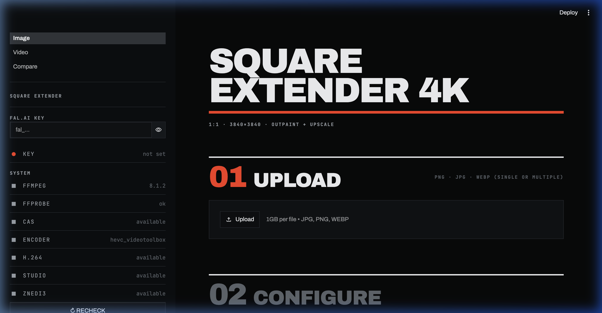
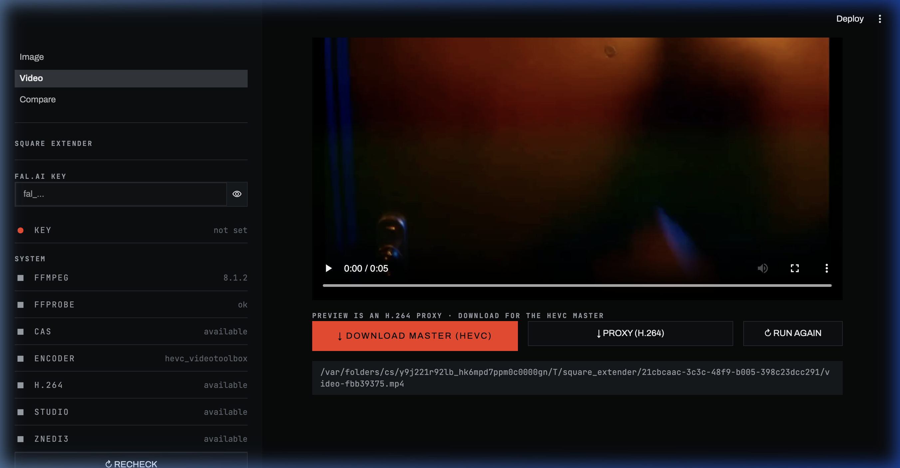
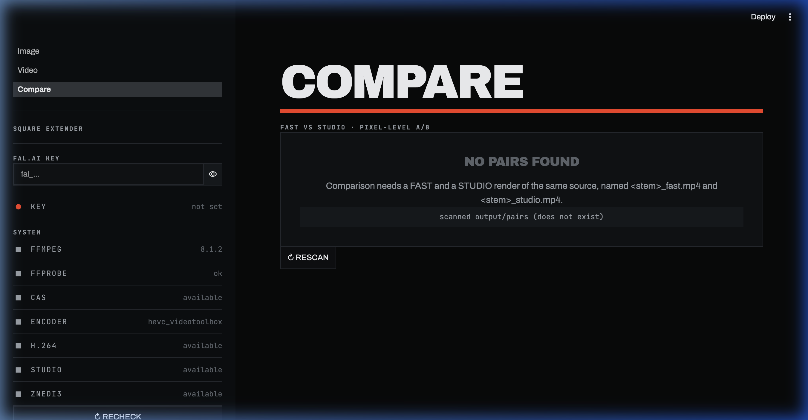

# Square Extender 4K

Converts images and videos into a **1:1 square 4K master (3840×3840)** by generatively outpainting padding via [fal.ai](https://fal.ai) and upscaling locally with hardware-accelerated **FFmpeg** or **VapourSynth**.

```
UPLOAD (Single / Batch)  →  CONFIGURE (Outpaint & Upscale)  →  RESULT (4K Master)
```

---

## Visual Showcase

### Image Processing & Multi-File Batch Mode


### Video Processing & Engine Selection


### Interactive Render Comparison


---

## Key Features

- ⚡ **Multi-Item Batch Upload**: Drop single or multiple images (`PNG`, `JPG`, `WEBP`) or videos (`MP4`, `MOV`, `AVI`, `WEBM`) at once.
- ⚙️ **Auto-Scaling Task Pool**: Dynamically manages CPU/GPU resources and queues jobs automatically when batch sizes exceed hardware capacity.
- 🎨 **Dual Pipeline Modes**:
  - **OUTPAINT + UPSCALE**: Generatively extends short edges via `fal.ai` cloud models before upscaling.
  - **UPSCALE ONLY**: Runs 100% locally with zero cloud API keys required.
- 🚀 **Dual Video Upscale Engines**:
  - **FAST**: FFmpeg Lanczos4 + Contrast Adaptive Sharpening (CAS). High-speed & universal.
  - **STUDIO**: VapourSynth `znedi3` neural net luma reconstruction + FineSharp.
- 🔍 **System Diagnostic & Self-Healing**: Auto-locates `ffmpeg`, `ffprobe`, `vspipe`, and HEVC hardware encoders across system PATHs and virtual environments.

---

## Quick Start

### 1. Requirements

- **Python 3.10 to 3.12+**
- **FFmpeg & FFprobe** (installed on system or PATH)

### 2. Environment Setup

```bash
# Clone repository
git clone https://github.com/LeDHoang/videoextendersquare.git
cd videoextendersquare

# Create virtual environment & install dependencies
python -m venv .venv
source .venv/bin/activate      # On Windows: .venv\Scripts\activate
pip install -r requirements.txt
```

### 3. API Key Configuration

Create a `.env` file from `.env.example`:

```env
FAL_KEY=your_fal_ai_api_key_here
```

> **Note**: `FAL_KEY` is only required for generative outpainting. **UPSCALE ONLY** mode runs entirely offline.

### 4. Launch Web Application

```bash
streamlit run app.py
```

Open **http://localhost:8501** in your browser.

---

## Architecture

```
app.py                  Streamlit entrypoint: layout, navigation, environment setup
.streamlit/config.toml  Native dark theme tokens & web fonts
docs/images/            Documentation UI screenshots
pipeline/               Core processing workers (thread-isolated)
├─ image_worker.py      fal.ai flux outpaint + FFmpeg Lanczos4 upscale
├─ video_worker.py      fal.ai Kling video outpaint + FFmpeg / VapourSynth znedi3 upscale
└─ utils.py             Geometry & padding math
ui/                     Editorial UI & state engine
├─ views/               image_view, video_view, compare_view
├─ runner.py            Thread pool manager with live progress streaming & queuing
├─ health.py            System PATH self-heal & hardware probes
├─ media.py             Session staging, proxies & result persistence
└─ assets/app.css       Custom theme CSS
```

---

## License

MIT License. Built for high-performance video and image transformation workflows.
