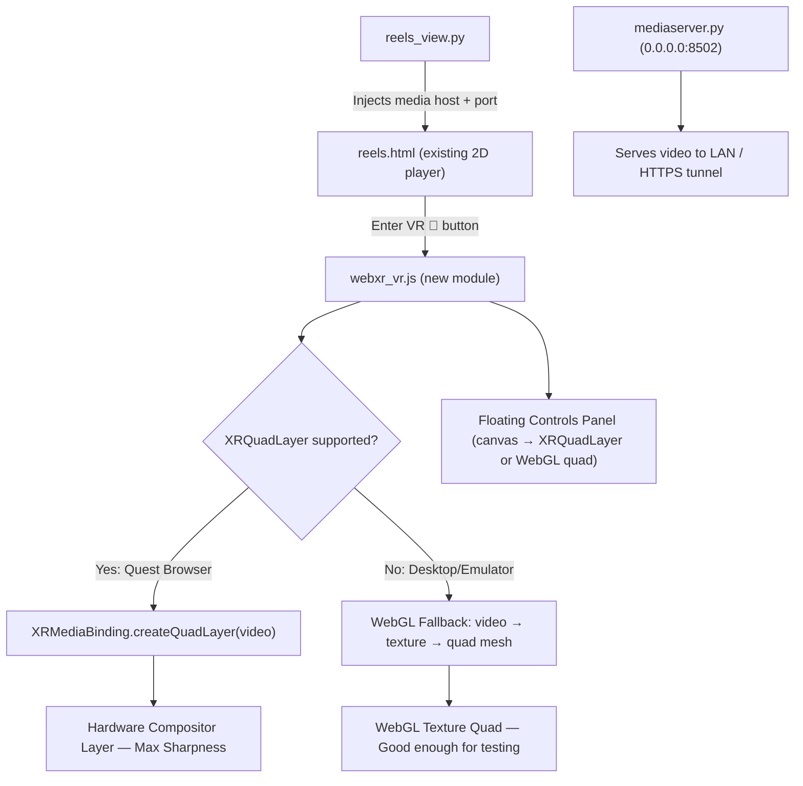

# WebXR VR Reels — Option C (`XRQuadLayer`) Implementation Plan

Add a YouTube VR–style immersive viewing mode to the existing Reels page. Users on desktop browsers continue to use the current 2D player unchanged. On WebXR-capable devices (Meta Quest 3S via browser), a **"Enter VR 🥽"** button launches an immersive session that renders 4K video on a hardware-composited `XRQuadLayer` — the same technique YouTube VR uses for maximum sharpness and low latency.

---

## Architecture Overview



---

## Resolved Design Decisions

| Question | Decision |
|---|---|
| Network binding | ✅ Bind `0.0.0.0` — approved |
| Media server port | ✅ Fixed port `8502` |
| VR background | ✅ Pure black |
| Screen repositioning | ✅ **Grip button** to grab + drag (DeoVR/PlayaVR style) |
| Screen resize | ✅ **Right thumbstick up/down** scales screen (moves closer/further) |
| Seek controls | ✅ **Right thumbstick left/right** = ±5s seek |
| Reel navigation | ✅ **Right trigger** = Next, **Left trigger** = Previous |
| Play/Pause | ✅ **A button** = toggle play/pause |
| Floating controls | ✅ YouTube VR–style transport panel appears when paused |

---

## VR Interaction Design

### Screen Grab & Reposition (DeoVR-style)

How DeoVR and PlayaVR handle this, and how we'll replicate it:

- **Grip button held** → the video screen "attaches" to the controller's ray and follows controller movement in 3D space.
- **Grip released** → the screen locks at its new world-space position.
- Implementation: On each XR frame while grip is held, compute the controller's aim ray, cast it forward by the screen's current distance, and update the `XRQuadLayer.transform` position + orientation accordingly.

```
Grip held → screen follows controller ray direction
Grip released → screen locks at new world position
```

### Screen Resize via Right Thumbstick Y-Axis

- **Right thumbstick up** → scale the screen larger (increase `width` and `height`, or move it further while maintaining angular size — effectively "zoom in").
- **Right thumbstick down** → scale the screen smaller.
- Implementation: Adjust the quad layer's `width` and `height` properties proportionally each frame while thumbstick Y is beyond a deadzone. Clamp between 1.0m and 8.0m width.

### Seek via Right Thumbstick X-Axis

- **Right thumbstick right** → seek +5s (fires once per flick past deadzone, not continuous).
- **Right thumbstick left** → seek -5s.
- Implementation: Use a "flick" detection — only trigger once when crossing the 0.5 threshold, reset when the thumbstick returns to center.

### Floating Transport Controls (YouTube VR-style)

When the video is **paused**, a floating controls panel appears below the video screen:

```
┌─────────────────────────────────────────┐
│              4K VIDEO SCREEN            │
│           (XRQuadLayer — main)          │
└─────────────────────────────────────────┘
                    ↕ gap
┌─────────────────────────────────────────┐
│  ⏮  ◀◀  ▶ PLAY  ▶▶  ⏭   🔊  ✕ EXIT  │
│  ━━━━━━━━━━●━━━━━━━━━━━━  2:15 / 4:30  │
│  filename.mp4 · 📁 folder · 24.5 MB    │
└─────────────────────────────────────────┘
```

**Implementation approach:**

1. **Render to an offscreen `<canvas>` element** — Draw the transport controls (progress bar, buttons, text) using Canvas 2D API.
2. **Create a second `XRQuadLayer`** (or WebGL textured quad for fallback) positioned below the main video quad.
3. **Ray-cast for interaction** — Use the controller's aim ray to detect which button the user is pointing at, highlight it, and trigger on `select` (trigger press).
4. **Show/hide** — Visible when paused or when the user presses a specific button. Fades in/out with opacity animation.

Controls on the panel:
- **⏮ Previous** / **⏭ Next** — Navigate reels
- **◀◀ -5s** / **▶▶ +5s** — Seek
- **▶ Play** / **⏸ Pause** — Toggle playback
- **🔊 / 🔇** — Toggle mute
- **✕ Exit VR** — End immersive session
- **Progress bar** — Seek by ray-pointing and clicking
- **Filename / folder / size** — Current reel metadata

---

## Complete Controller Mapping

| Input | Action |
|---|---|
| **Right Trigger** (select) | Next reel |
| **Left Trigger** (select) | Previous reel |
| **A Button** | Play / Pause |
| **Right Thumbstick ↑/↓** | Resize screen (scale up/down) |
| **Right Thumbstick ←/→** | Seek -5s / +5s |
| **Either Grip (hold)** | Grab & reposition screen |
| **B Button** | Toggle floating controls visibility |
| **Menu / Meta Button** | Reset screen position to default |

---

## Proposed Changes

### Media Server (Network Access)

#### [MODIFY] [mediaserver.py](file:///Users/hoangleduc/Documents/%5Bez%5D/Coding/VR%20Tiktok/videoextendersquare/ui/mediaserver.py)

Two changes:

1. **Bind to `0.0.0.0` on fixed port `8502`** instead of `127.0.0.1` on ephemeral port:

```diff
-    httpd = ThreadingHTTPServer(("127.0.0.1", 0), handler)
+    MEDIA_PORT = int(os.environ.get("SX_MEDIA_PORT", 8502))
+    httpd = ThreadingHTTPServer(("0.0.0.0", MEDIA_PORT), handler)
```

2. **Update `media_url()`** to construct URLs using the request's hostname (so VR headsets and tunnels get correct URLs):

```diff
 def media_url(root: str, path: str | Path) -> str | None:
+def media_url(root: str, path: str | Path, host: str | None = None) -> str | None:
     ...
-    return f"http://{host}:{port}/{quote(rel)}"
+    serve_host = host or _detect_lan_ip() or "127.0.0.1"
+    return f"http://{serve_host}:{port}/{quote(rel)}"
```

Add a helper `_detect_lan_ip()` using `socket.gethostbyname(socket.gethostname())` as a fallback.

---

### Backend (Reels View)

#### [MODIFY] [reels_view.py](file:///Users/hoangleduc/Documents/%5Bez%5D/Coding/VR%20Tiktok/videoextendersquare/ui/views/reels_view.py)

- Inject the media server port (`__MEDIA_PORT__`) as a template variable so the frontend JS can construct URLs against `window.location.hostname` for VR device access.
- The current `media_url()` calls in the video payload construction stay as-is for 2D mode; the VR mode JS will rewrite URLs client-side using the injected port.

```diff
     html = _template().replace("__VIDEO_DATA_JSON__", json.dumps(video_payload))
+    html = html.replace("__MEDIA_PORT__", str(MS.MEDIA_PORT))
     components.html(html, height=750)
```

---

### Frontend — WebXR VR Module

#### [NEW] [webxr_vr.js](file:///Users/hoangleduc/Documents/%5Bez%5D/Coding/VR%20Tiktok/videoextendersquare/ui/assets/webxr_vr.js)

New standalone JavaScript module (~400–500 lines). Will be inlined into `reels.html` at build time (same pattern as existing code).

**Module structure:**

```javascript
const WebXRVR = (function() {
  // --- State ---
  let xrSession = null;
  let xrRefSpace = null;
  let videoLayer = null;        // XRQuadLayer for the video
  let controlsLayer = null;     // XRQuadLayer for floating controls
  let controlsCanvas = null;    // Offscreen canvas for controls rendering
  let videoElement = null;
  let callbacks = {};           // { onNext, onPrev, onTogglePlay, onSeek }
  
  // Screen transform state
  let screenPos = { x: 0, y: 1.5, z: -3 };  // 3m in front, eye level
  let screenScale = 2.5;       // meters (width = height for 1:1)
  let isGrabbing = false;
  let grabController = null;
  
  // Controls state
  let controlsVisible = false;
  let thumbstickFlicked = { x: false, y: false };  // flick debounce

  // --- Public API ---
  return {
    init(video, cbs) { ... },
    async isSupported() { ... },
    async enterVR() { ... },
    exitVR() { ... },
  };
})();
```

**Core sections:**

1. **`enterVR()`** — Request immersive-vr session:
   ```javascript
   xrSession = await navigator.xr.requestSession('immersive-vr', {
     requiredFeatures: ['local-floor'],
     optionalFeatures: ['layers']
   });
   ```
   Then detect if `XRMediaBinding` is available (Quest) or fall back to WebGL.

2. **`setupQuadLayer()`** (Quest path):
   ```javascript
   const binding = new XRMediaBinding(xrSession);
   videoLayer = binding.createQuadLayer(videoElement, {
     space: xrRefSpace,
     width: screenScale,
     height: screenScale,
     layout: 'mono',
     transform: new XRRigidTransform(screenPos, {x:0, y:0, z:0, w:1})
   });
   ```

3. **`setupWebGLFallback()`** (Desktop/Emulator path):
   - Create `XRWebGLLayer` with a basic WebGL context.
   - Render a textured quad in the XR frame loop, sampling the video element each frame.

4. **`onXRFrame(time, frame)`** — The core render loop:
   - Read controller input sources → process grip (grab), thumbstick (resize/seek), triggers (next/prev), A button (play/pause).
   - If grabbing: update `videoLayer.transform` to follow controller ray.
   - If thumbstick Y active: adjust `videoLayer.width` / `videoLayer.height`.
   - If thumbstick X flicked: call `onSeek(±5)`.
   - Redraw controls canvas if visible.

5. **`renderControlsCanvas()`** — Draw transport controls to offscreen `<canvas>`:
   - Progress bar with current time / duration.
   - Button icons (Prev, -5s, Play/Pause, +5s, Next, Mute, Exit).
   - Current filename, folder, file size text.
   - Highlighted button state based on controller ray intersection.

6. **`handleControlsRaycast(controller, frame)`** — Hit-test the controller ray against the controls quad to determine which button is hovered/selected.

7. **`exitVR()`** — End session, clean up layers, restore 2D UI.

---

### Frontend — Reels HTML Integration

#### [MODIFY] [reels.html](file:///Users/hoangleduc/Documents/%5Bez%5D/Coding/VR%20Tiktok/videoextendersquare/ui/assets/reels.html)

1. **Inline `webxr_vr.js`** at the top of the `<script>` block (before the existing IIFE).

2. **Add "Enter VR 🥽" button** to `.reels-actions`:
   ```html
   <div id="vrBtnWrap" style="display:none;">
     <button class="action-btn" id="vrBtn" title="Enter VR Mode">🥽</button>
     <div class="action-btn-label">VR</div>
   </div>
   ```

3. **Add CSS** for VR button and VR-active state:
   ```css
   #vrBtn {
     background: rgba(88, 28, 135, 0.8);
     border-color: rgba(168, 85, 247, 0.5);
   }
   #vrBtn:hover {
     background: #7C3AED;
     border-color: #A855F7;
     box-shadow: 0 0 20px rgba(168, 85, 247, 0.4);
   }
   .vr-active .reels-badge { background: #7C3AED; }
   .vr-active .reels-badge::after { content: ' · VR'; }
   ```

4. **Wire up** inside the existing IIFE:
   ```javascript
   // Feature detect and show VR button
   if (navigator.xr) {
     navigator.xr.isSessionSupported('immersive-vr').then(ok => {
       if (ok) document.getElementById('vrBtnWrap').style.display = '';
     });
   }
   
   WebXRVR.init(video, {
     onNext: nextVideo,
     onPrev: prevVideo,
     onTogglePlay: togglePlay,
     onSeek: seekRelative,
     getPlaylist: () => videoData,
     getCurrentIndex: () => idx,
   });
   
   document.getElementById('vrBtn').addEventListener('click', () => {
     WebXRVR.enterVR();
   });
   ```

---

## Testing Strategy

### Method 2: Dual HTTPS Tunnel (Real Quest Headset)

```bash
# Terminal 1: Start the app
streamlit run app.py

# Terminal 2: Tunnel for Streamlit
npx localtunnel --port 8501

# Terminal 3: Tunnel for media server
npx localtunnel --port 8502
```

Then on the Quest Browser:
1. Open the Streamlit tunnel URL → Navigate to REELS.
2. The JS detects `navigator.xr` support → "Enter VR 🥽" button appears.
3. Click it → Immersive VR session starts.
4. Video renders on floating `XRQuadLayer` in pure black space.
5. Test: triggers (next/prev), thumbstick (resize/seek), grip (reposition), A (play/pause).
6. Pause → floating controls panel appears below screen.
7. Point controller ray at controls → buttons highlight → trigger to press.

> [!IMPORTANT]
> The video URLs in the playlist point to `http://127.0.0.1:8502/...`. In VR mode, the JS will rewrite these URLs to use the media tunnel URL. We'll inject `__MEDIA_TUNNEL_URL__` as a template placeholder, OR the JS will detect it's on a tunnel and dynamically resolve the correct media base.

### Method 3: Desktop WebXR Emulator (No Headset)

1. Install **WebXR API Emulator** Chrome extension.
2. Run `streamlit run app.py` → Open `http://localhost:8501/reels`.
3. Open Chrome DevTools → **WebXR** tab → Select "Meta Quest 3".
4. Click "Enter VR 🥽" → WebGL fallback path activates (emulator doesn't support Layers API).
5. Video renders on a WebGL textured quad.
6. Use emulator's virtual controllers to test input mapping.

> [!NOTE]
> The desktop emulator exercises the **WebGL fallback path** only. The `XRQuadLayer` hardware compositor path can only be tested on a real Quest headset.

---

## File Summary

| File | Action | Description |
|---|---|---|
| [mediaserver.py](file:///Users/hoangleduc/Documents/%5Bez%5D/Coding/VR%20Tiktok/videoextendersquare/ui/mediaserver.py) | MODIFY | Bind `0.0.0.0:8502`, update `media_url()` for LAN/tunnel access |
| [reels_view.py](file:///Users/hoangleduc/Documents/%5Bez%5D/Coding/VR%20Tiktok/videoextendersquare/ui/views/reels_view.py) | MODIFY | Inject `__MEDIA_PORT__` template variable |
| [reels.html](file:///Users/hoangleduc/Documents/%5Bez%5D/Coding/VR%20Tiktok/videoextendersquare/ui/assets/reels.html) | MODIFY | Add VR button, CSS, integrate WebXRVR module |
| [webxr_vr.js](file:///Users/hoangleduc/Documents/%5Bez%5D/Coding/VR%20Tiktok/videoextendersquare/ui/assets/webxr_vr.js) | NEW | ~500 lines: WebXR session, XRQuadLayer + WebGL fallback, grip reposition, thumbstick resize/seek, floating controls canvas, controller ray interaction |

## Verification Plan

### Manual Verification

1. **Desktop 2D (regression)**: `localhost:8501/reels` — existing player works identically. VR button hidden if no WebXR support.
2. **Desktop emulator (Method 3)**: WebXR Emulator → Click "Enter VR" → Verify WebGL fallback renders video on quad, emulated controllers navigate.
3. **Meta Quest (Method 2)**: Dual HTTPS tunnel → Open REELS → "Enter VR" → Verify:
   - `XRQuadLayer` renders crisp video
   - Grip grabs/repositions screen
   - Right thumbstick up/down resizes
   - Right thumbstick left/right seeks ±5s
   - Triggers navigate reels
   - A button pauses → floating controls appear
   - Controls panel is ray-interactive (point + trigger to click)
