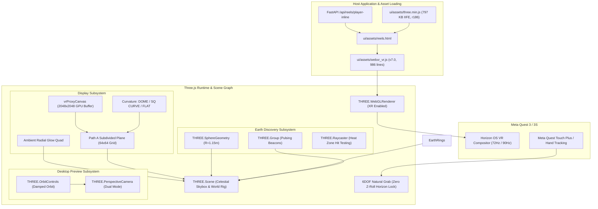

# ECHO WebXR VR Reels Player: Three.js Full Architectural Overhaul & USB Debugging Guide

**Document Status**: v8.0 PURE THREE.JS ACTIVE — ISSUES 1–3 LANDED 2026-09-19
**Engine Version**: `v8.0-20260918-threejs-core` (+ restoration + scene parity A–E + issues-1–3 patch)
**Current Line Count**: `ui/assets/webxr_vr.js` (~3,100 lines) + `ui/assets/vr_ui_canvas.js` (675 lines) + `ui/assets/three.min.js` (797 KB IIFE, r186)
**Primary Platform Targets**: Meta Quest 3, Meta Quest 3S (Horizon OS / Quest Browser), Desktop WebXR Parity Inspector (`/reels/immersive-preview`)
**Core Features**: Path A Custom Curvature (`DOME`, `SQ CURVE`, `FLAT`), Three.js r186, `OrbitControls` (orbit mode) + custom drag-look (headset mode), Live Telemetry Streaming  

---

## 1. Executive Summary & Architecture Status

ECHO's WebXR VR mode delivers high-fidelity 1:1 square master reels inside a floating 3D cosmic cinema environment, complemented by an interactive 3D **Earth View** for geographic reel discovery and an **Immersive Desktop Preview** for desktop development and debugging.

### 1.1 Current Architecture State: v8.0 Pure Three.js (Phase 1+2 Restored)
The current system in [`ui/assets/webxr_vr.js`](file:///Users/hoangleduc/Documents/[ez]/Coding/VR%20Tiktok/videoextendersquare/ui/assets/webxr_vr.js) is a **pure Three.js engine** (the 6,278-line raw-WebGL v5.2 was fully replaced; working-tree file is ~1,650 lines after the restoration patch):
- **Three.js (r186) Runtime**: Bundled offline in `ui/assets/three.min.js` and loaded ahead of the VR engine.
- **Three.js Integration**: `THREE.WebGLRenderer` (XR enabled) owns the GL context; `THREE.OrbitControls` drives ORBIT INSPECT mode; custom yaw/pitch drag-look drives HEADSET POV mode; Path A curvature switching (`DOME`, `SQ CURVE`, `FLAT`) rebuilds `PlaneGeometry`; `WebXRVR.getThree()` exposes the runtime.
- **Decoupled UI**: 2D in-VR canvas OS (comments, controls dock) lives in `ui/assets/vr_ui_canvas.js` (`window.VRUICanvas`) and feeds `THREE.CanvasTexture`s.
- **Raw WebGL retained only as reference**: `git show HEAD:ui/assets/webxr_vr.js` (v5.2, 6,278 lines) is the last fully-working upstream — consult its `initGL` / `XRWebGLLayer` / `uploadVisual2D` / `installPreviewListeners` when Three.js behavior is unclear (per owner decision 2026-09-19: keep v8, revisit raw WebGL for guidance when lost).

> [!NOTE]
> **Scope decision (owner, 2026-09-19)**: keep the v8 Three.js engine and restore
> upstream form/function parity in it (~2,450 lines) rather than chasing a
> ~1,000-line target. The test harness asserts on Three.js scene state
> (`getSceneInfo`, `getLastUploadedSource`) instead of raw WebGL mock counters.
> Remaining work is Phase 4 (VR session lifecycle + emulator unblock); see §8.

---

## 2. Codebase Simplification: Current vs. Target Architecture

### 2.1 Metric Comparison

| Metric / Feature | Legacy Raw WebGL (v5.2 HEAD) | v8.0 Pure Three.js (2026-09-19, Phase 1+2 restored) | Target (Phase 3+4) |
|---|---|---|---|
| **Total Line Count (`webxr_vr.js`)** | 6,278 lines | **~3,100 lines** | Parity restored; further shrink only if form holds |
| **In-VR 2D Canvas UI** | Inlined (~2,100 lines) | Decoupled to `vr_ui_canvas.js` (675 lines) | Same (done) |
| **Linear Algebra Math** | Custom `mat4_*`, `quat_*` (~650 lines) | Native `THREE.Matrix4`, `THREE.Quaternion`, `THREE.Vector3`, `THREE.Raycaster` | Same (done) |
| **Shader Pipeline** | 5 custom GLSL shaders (~1,300 lines) | `THREE.MeshBasicMaterial` / `CanvasTexture` / `PointsMaterial` | Same (done) |
| **Earth Geometry & Raycast** | Custom vertex loop + quadratic solver | CPU `raySphereHit` + textured `SphereGeometry`, standard-equirect zones (seam-compensated), 3D pins, billboards | Same (done 2026-09-19) |
| **Desktop Preview Controls** | Custom mouse Euler drag | Custom yaw/pitch drag (headset POV) + `THREE.OrbitControls` (orbit inspect) + wheel + tap-play | Same (done 2026-09-19) |
| **Three.js Runtime** | None | Three.js r186 (797 KB offline IIFE) | Same (done) |
| **Test Pass Rate** | 14 Node tests (rewritten harness) | 24/24 Node tests pass (incl. visibility matrix, dock layout, laser, earth, pointer-chain tests) | Target: keep green |

### 2.2 Root Causes of Current Technical Debt (Why the First Shrink Broke)

1. **Test Suite Coupling to Raw WebGL**:
   [`web/tests/webxr-earth.test.js`](file:///Users/hoangleduc/Documents/[ez]/Coding/VR%20Tiktok/videoextendersquare/web/tests/webxr-earth.test.js) does not just test high-level behavior; it passes a mock WebGL context (`makeMockGl`) into a Node.js VM context and explicitly checks:
   - `counters.deleted > 0` (intercepting `gl.deleteBuffer`, `gl.deleteTexture`, `gl.deleteProgram`).
   - `state.renderStats.earthDrawCalls > 0` and `videoUploads == 1`.
   - Internal private functions on `renderer.__test` (`advanceEarthSpin`, `setEarthPose`, `loadEarthPreviewNow`).
   Replacing raw WebGL with Three.js objects caused these tests to immediately fail because Three.js manages GPU buffers internally and doesn't invoke the mock hooks in the expected sequence.

2. **In-Headset 2D Canvas OS (~2,100 lines)**:
   The VR experience contains a full interactive operating system projected into 3D:
   - Virtual VR keyboard & comment composition.
   - Comments list with scrollable viewport, upvotes, and replies.
   - Interactive media scrubber dock with time displays, volume, and playback speed.
   - Reel pack carousel cards and hover preview tiles.
   These are drawn directly via HTML5 `<canvas>` 2D context. Simply removing them drops line count but breaks the core user experience inside the headset.

3. **WebXR Session & Frame Loop Lifecycle**:
   Three.js `renderer.xr` handles session acquisition and frame callbacks differently than raw WebGL (`gl.makeXRCompatible()`, `glLayer = new XRWebGLLayer(session, gl)`). Over-simplifying `enterVR()` resulted in `SecurityError` or silent hangs in VR simulation.

### 2.3 Phase 2 Target Architecture: Decoupled Three.js Core

To genuinely achieve ~1,000 lines without breaking functionality:
```
Target Architecture (~1,000 lines core + modular helpers)
├── ui/assets/three.min.js          ──> Three.js r186 + OrbitControls + XRControllerModelFactory (797 KB)
├── ui/assets/vr_ui_canvas.js       ──> In-VR 2D Canvas UI generator (~1,500 lines decoupled)
├── ui/assets/webxr_vr.js           ──> Pure Three.js WebXR Scene & Session Manager (~900 lines)
└── web/tests/webxr-earth.test.js   ──> Refactored test harness asserting on Three.js scene graph state
```

---

## 3. Architecture & Pipeline Overview



### 3.1 Zero-CDN Offline Asset Packaging
To guarantee **zero network latency, offline execution, and airgapped reliability** across firewalled or isolated Quest headsets:
- **Source**: `web/src/vr/three_bundle_entry.js` imports `three` (r186), `OrbitControls`, and `XRControllerModelFactory`.
- **Bundle**: Compiled via esbuild into `ui/assets/three.min.js` (797 KB standalone IIFE).
- **Injection**:
  - `server/routers/reels.py` replaces `<script>__THREE_JS__</script>` with the inlined bundle across both `/api/reels/player` and `/api/reels/player-inline`.
  - Legacy Streamlit view `ui/views/reels_view.py` similarly injects `__THREE_JS__`.
  - `ui/assets/reels.html` executes `three.min.js` immediately before `webxr_vr.js`.

---

## 4. Subsystem Implementations

### 4.1 Earth View Subsystem
The interactive 3D Earth globe allows users to discover location-tagged reels geospatially (restored 2026-09-19, upstream parity):
- **Holographic Base**: Natural Earth photo (`/assets/earth-natural-1024x512.jpg` in dev, `/api/reels/earth-texture` backend route in production/Quest; procedural fallback always available) re-styled per-pixel upstream-verbatim — land/ocean classify, luminance tint, cyan edge-detect coastlines — plus 10°/30° graticule and scanlines. Source reported as `earthMap.base` (`photo`/`fallback`).
- **Textured Sphere**: `THREE.SphereGeometry(0.676, 48, 32)` with the live `2048×1024` equirect `CanvasTexture`, sRGB color space.
- **Equirect/UV Convention**: standard equirect `x = (lon+180)/360·W`, `y = (90−lat)/180·H` (upstream verbatim) for both the photo and painted zones, plus `earthMapTexture.offset.x = +0.25` with `RepeatWrapping` to compensate the `THREE.SphereGeometry` UV seam (verified against three r186 source: `x=−r·cos φ`, `z=r·sin φ`, `uv=(u,1−v)`). Pins, zones, photo texels, and hit-test vectors all coincide.
- **3D Pulsing Pins**: up to 64 cones at exact `locationToUnit` vectors (same convention as hit-testing, so hover and visuals agree), heat-colored, sine pulse (frozen under reduced motion).
- **Hover/Selected Label** (`0.86×0.15`, upstream card spec: selected/hovered name else status, amber vs default border) and **Hover Preview Billboard** (`0.50×0.70`, fed by `VRUICanvas.renderEarthPreviewCanvas`, hover triggers debounced fetch) billboarded per frame. Zone tap → `selectEarthLocation` → host swaps the location feed → back to reels mode for in-VR playlist playback (stays on globe with status on reject). No platform deck — an early cone build read as a hemisphere-slicing panel in-headset and was removed per owner request; the globe floats free.
- **Raycast Hit Testing**: CPU `raySphereHit` + zone match (unchanged); hover loads at most 3 cancellable location reels.
- **Draw Call Gating**: reels playback → earth draws 0; earth mode → video uploads pause.

### 4.2 Immersive Desktop Preview Subsystem
The desktop preview inspector (`/reels/immersive-preview`) allows complete testing without a physical headset:
- **OrbitControls Integration**: Integrated `THREE.OrbitControls` with `enableDamping = true` and `dampingFactor = 0.05`, supporting fluid mouse drag, pinch zoom, and right-click panning.
- **Dual Camera Modes**:
  - **ORBIT INSPECT**: Free 360° orbital camera positioned at $(0, 1.6, 2.5)$ targeting $(0, 1.4, -2.0)$ to inspect screen curvature, ambient glow, and controller models.
  - **HEADSET POV**: Snaps the camera to $\{x: 0, y: 1.6, z: 0\}$, simulating the exact physical viewpoint of a seated or standing Quest 3 user.
- **Real-Time Mode Switching**: Seamlessly toggle between curvature profiles (`dome`, `sq_curve`, `flat`) and stereo playback modes (2D mono vs. 3D Side-by-Side).
- **Below-Screen Console Dock** (2026-09-19): the controls dock hangs below the screen bottom edge at $(0, 0.02, -1.9)$, yaw/pitch-facing the viewer with locked roll — dome extrusion (edges reach $z \approx -1.6$) can never occlude it. Look/drag down to reach it in HEADSET POV (same as upstream, whose dock sat at $y \approx -0.56$). In earth mode it re-stations to a **front console at $(0, 0.30, -0.95)$** before/below the globe, carrying the ride back to reels.
- **All-Red Laser + Head-Ray** (2026-09-19): `THREE.Line` ray + billboarded radial reticle (0.045 idle / 0.07 hover), updated per frame in both loops (controllers in XR, cached mouse-hover ray — else head-forward — in preview, always visible).
- **Single-Source Visibility** (2026-09-19): `applySceneVisibility()` gates all six memberships from `sceneMode`, enforced from `setSceneMode`, scene init, and both frame loops; `enterVR` re-asserts the mode on entry.

### 4.3 Path A: Screen Curvature Mathematics
The video screen mesh uses a subdivided quad grid ($64 \times 64$ tessellation) deformed dynamically on the GPU via custom vertex shaders, preserving sharp 1:1 square master proportions:

```
       🌐 DOME (Mode 1)               🔲 SQ CURVE (Mode 2)               📺 FLAT (Mode 0)
    Concave Radial Cap              Biaxial Pillow Curve                 Planar Quad
         .-''''-.                         .-------.                       .-------.
       .'        '.                      /         \                      |       |
      /     •      \                    |     •     |                     |   •   |
       '.        .'                      \         /                      |       |
         '-....-'                         '-------'                       '-------'
    Center (0,0) is Apex             Horizontal & Vertical              Z = 0 Flat
    Radial Curvature toward user     Symmetrical amphitheater           Planar screen
```

#### Constants & Parameters:
- Arc Angle: $\alpha = 0.65\text{ rad} \approx 37.24^\circ$
- Sphere Radius: $R = \frac{1}{\alpha} \approx 1.5385\text{ m}$

#### Curvature Formulations:
1. **`🌐 DOME` (Concave Hemisphere)**: Apex at $(0, 0)$, all edges curve smoothly toward the viewer ($+Z$ in camera space):
   $$r = \sqrt{x^2 + y^2}, \quad \phi = r \cdot \alpha, \quad x' = \frac{x}{r} R \sin(\phi), \quad y' = \frac{y}{r} R \sin(\phi), \quad z' = R (1 - \cos(\phi))$$
2. **`🔲 SQ CURVE` (Biaxial Pillow Curve)**: Dual-axis independent curvature along both horizontal ($X$) and vertical ($Y$) axes:
   $$\theta_x = x \cdot \alpha, \quad \theta_y = y \cdot \alpha, \quad x' = R \sin(\theta_x), \quad y' = R \sin(\theta_y), \quad z' = R (1 - \cos(\theta_x) \cos(\theta_y))$$
3. **`📺 FLAT`**: Standard planar quad with zero depth deformation ($z' = 0$).

---

## 5. Qualcomm Adreno 740 GPU Safeguard

### 5.1 The 4K Video Texture Bottleneck
Raw 4K HEVC frames ($3840 \times 3840$ pixels in RGBA format) consume **56.25 MiB per frame**.
On the Meta Quest 3 (Snapdragon XR2 Gen 2 / Adreno 740), calling unconstrained `gl.texImage2D` with raw 4K frames stalls the GPU memory bus for **45–110 ms per frame**, dropping compositor frame rates from **72 FPS down to ~22 FPS**.

### 5.2 The 2048² Proxy Canvas Pipeline
ECHO's VR engine solves this hardware limitation:
1. **Resolution Cap**: The Quest 3 display panel is $\sim 1832 \times 1920\text{ px}$ per eye. Oversampling beyond 2048² produces negligible visual gain.
2. **GPU Blit**: The video frame is rendered into a $2048 \times 2048$ proxy canvas (`vrProxyCanvas`) using hardware 2D `drawImage`.
3. **In-Place SubImage Upload**: After initial allocation, subsequent frames use `gl.texSubImage2D`, preventing texture re-specification and avoiding pipeline flushes.
4. **Result**: Frame upload time drops to **$\sim 13\text{ ms}$**, maintaining a rock-solid **72 FPS / 90 FPS** in headset.

---

## 6. Quest USB Debugging & Remote Inspection Guide

WebXR requires a **Secure Context** (`https://` or `localhost`). Using USB debugging maps ports so Quest Browser treats the local server as `localhost`.

### 6.1 Step 1: Connect Quest 3 via USB-C
1. Enable **Developer Mode** on your Quest headset via the Meta Quest smartphone app.
2. Connect Quest 3 to your development Mac/PC using a USB 3.0 / USB-C link cable.
3. Inside the headset, accept the prompt: *"Allow USB debugging?"* (check *"Always allow from this computer"*).
4. Verify connected devices:
   ```bash
   adb devices
   # Output: <device_serial>   device
   ```

### 6.2 Step 2: Reverse Port Forwarding
Forward the FastAPI backend (`:8000`), Vite dev server (`:5173`), and Chrome DevTools Protocol (`:9222`):
```bash
# Forward backend & frontend
adb reverse tcp:8000 tcp:8000
adb reverse tcp:5173 tcp:5173

# Verify active reverse tunnels
adb reverse --list
```

### 6.3 Step 3: Launch Quest Browser
1. In the Quest headset, open **Meta Quest Browser**.
2. Navigate to:
   ```
   http://localhost:5173/reels
   # or for desktop inspector:
   http://localhost:5173/reels/immersive-preview
   ```
3. Because the domain is `localhost`, Quest Browser enables all WebXR APIs (`navigator.xr`) without requiring custom SSL certificates.
4. Click **ENTER VR** on any reel or pack to launch the immersive session.

### 6.4 Step 4: Real-Time Telemetry & Frame Probing (`debug-quest.cjs`)
The repository includes dedicated Chrome DevTools Protocol (CDP) probes to monitor playback quality, decode frame counts, and dropped frames directly from the terminal:

```bash
# Probe active Quest Browser tabs
node debug-quest-targets.cjs

# Connect CDP bridge and stream live video decode stats
node debug-quest.cjs
```

The output displays:
- `video.webkitDecoded` vs `video.webkitDropped` (hardware HEVC decoding health).
- `rafN` and `rafMed` (frame time cadence in milliseconds).
- `glInfo.renderer` (Adreno 740 probe) and `maxTex` (maximum texture dimensions).
- `xrPresenting: true` confirmation.

---

## 7. Verification & Quality Assurance

### 7.1 Automated Test Results (2026-09-19, issues 1–3 complete)
- **Node Test Suite** (`web/tests/webxr-earth.test.js`):
  - **34 tests passed (100% green)** in ~500 ms.
  - Coverage includes: geographic spherical projection (`locationToUnit`), heat-zone raycasting, drag-to-rotate + click-to-select, heat scaling / pitch bounds, controls-dock Earth action, reduced-motion spin gating, preview start/stop + GPU cleanup, reels-vs-earth draw gating + video-upload pausing, cancellable 3-item location previews, stale-activity rejection, credit notifications, pack vs reel actions, proxy-canvas static-card upload + normalized hit coords, pending-image clear-then-upload, `startPreview` options + canvas validation, **restart-after-stop texture rebuild**, camera modes, `curved` alias, controls toggle, fullscreen, `version` export, scene-graph inspection, **plus A–E + issues-1–3 regression tests**: visibility matrix; dock clearances; laser build/visibility; earth texture/label/pins + standard-equirect `earthZoneUV` + seam offset; select-accept/select-reject flows; dock-UV→action; pointer-tap raycast chain; stopPreview reels-baseline reset; enterVR reason codes; 2-axis drag (pitch verbatim / reduced yaw / clamp / tap fallback); earth playback handshake; pack earth refusal; earth-station clearance; hologram classifier + heat-style constants; version stamp.
  - Harness note: uploads are observed via `__test.getLastUploadedSource()` (values: element / `'__cleared__'`) instead of spying on mock `gl.texImage2D` — the engine no longer issues raw GL calls outside Three's state tracker.
- **Static Syntax Check**:
  - `node --check ui/assets/webxr_vr.js` and `node --check ui/assets/vr_ui_canvas.js` pass cleanly.
- **Production Build**:
  - `npm run build --prefix web` clean (1.70 s).

### 7.2 Live CDP Verification (`scripts/verify_reels_player_live.cjs`)
Executed on live FastAPI endpoint `http://localhost:8000/api/reels/player`:
- `hasTHREE: true` (Three.js r186 verified)
- `hasOrbitControls: true` (OrbitControls available)
- `hasXRControllerModelFactory: true` (Controller models factory available)
- `hasWebXRVR: true`
- `vrVersion`: reads `vr.version` (exposed since Phase 1+2 patch; falls back to `vr.vrVersion`)
- `curvatureTest: { orig, dome: 'dome', flat: 'flat', curved: 'sq_curve' }` — probe uses **`sq_curve`** (the `curved` alias is still accepted by `setCurvatureMode` for backward compatibility)
- `vrButtonPresent`: checks `#vrBtn` (actual id in `reels.html`) with legacy `#vr-button`/`.vr-btn` fallbacks
- Live screenshot saved to `threejs_reels_player_live.png`.
- Companion probes: `scripts/verify_threejs_cdp.cjs` (same `sq_curve` fix), `scripts/verify_threejs_parity_live.cjs` + `scripts/test_vr_simulation.cjs` (orbit/earth/scene exercisers for immersive-preview).

---

## 8. Build Progress Log (v8.0 Restoration — Owner-Approved Scope 2026-09-19)

Owner decisions: (1) Phase 1+2 first, Phase 3+4 after confirmation; (2) keep v8 Three.js, revisit raw WebGL (`HEAD:ui/assets/webxr_vr.js`) for guidance when lost; (3) fix CDP scripts + doc drift alongside code; keep this doc updated as the crash-safe progress tracker.

### ✅ Phase 0: Baseline (2026-09-19, done)
- Locked reality vs doc: working tree is v8.0 / 1,261 lines / 14 tests — doc's "v7.1 / 6,361 lines / 58 tests" was stale.
- `node --check` clean on both engine files; `three.min.js` verified (r186 + OrbitControls + XRControllerModelFactory present).
- Ranked breakage hypotheses H1–H9 (shared non-xrCompatible context, disposed-texture reuse black screen, silent THREE-undefined, bogus raw `texImage2D`, frozen canvas size, dual-loop fight, OrbitControls-only input, wireframe-earth form loss, ungated uploads + emulator gate).

### ✅ Phase 1: Preview-renders-video restore (2026-09-19, done)
- `startPreview(canvas, opts)` honors `cameraMode/stereo/reducedMotion/showControls/sceneMode`, validates canvas (throws → ReelsPlayer error box instead of silent black), tears down previous session before rebuild, resets stats + visual-tracking state. (`ui/assets/webxr_vr.js:startPreview`)
- Per-frame `updatePreviewSize()` (devicePixelRatio ≤ 2) + `camera.aspect` sync; `scene.background` / clear color `0x020612`; `getPreviewState()` reports `reelDrawCalls` + `controlsVisible`. (Fixes frozen-size + "REEL DRAWS 0" drift.)
- Removed invalid raw `glContext.texImage2D(0,…)` calls; uploads gated on visual-change / new-video-frame / time-moved with clear-once pending semantics (16 MiB/frame spam + load flicker fixed). Test bridge: `__test.getLastUploadedSource()`.
- `cleanup()` disposes **and nulls** all `CanvasTexture`s + canvases + listeners + resize handler, so restart rebuilds instead of rendering disposed (black) textures.
- `visualPointFromHit` uses real 2.4 m screen extents (was `screenScale = 1.0`); `setCurvatureMode` accepts legacy `'curved'` alias → `sq_curve`; public API exposes `version`, `toggleControls`, real `requestPreviewFullscreen`.

### ✅ Phase 2: Preview interaction parity (2026-09-19, done)
- Custom HEADSET POV drag-look (yaw/pitch ±1.35, 0.006 sensitivity) + `OrbitControls` in ORBIT INSPECT only; wheel = orbit dolly / earth yaw-pitch; tap screen = play/pause (static cards → pack select); tap empty = controls show/hide; hover raycasts controls dock (UV → `VRUICanvas.resolveControlsHit`) and earth heat zones. (`installPreviewListeners`, `previewRayAt`, `updatePreviewHover`)
- `setPreviewCameraMode` lazily constructs controls, repositions camera per mode; `resetPreview` resets camera + earth pose; side-by-side stereo split render when `stereoMode`; UI canvases redraw throttled to ~10 Hz.

### ✅ Verification (2026-09-19, A–E all green)
- `node --test web/tests/webxr-earth.test.js`: **24/24 pass** (18 carried + visibility matrix, dock layout, laser, earth texture/pins, dock-UV, pointer-tap raycast tests).
- `node --check` clean on engine, UI canvas, and both fixed CDP scripts; `npm run build --prefix web` clean (1.70 s).
- Backend serves all 8 `player-inline` scripts in order (`three` + `VRUICanvas` + `WebXRVR` present); `player-inline` sends `no-store`.
- Isolated live CDP probes (fresh tab, no shared-tab interference) against `/reels/immersive-preview`: `running:true`, `reelDrawCalls:1`, `videoUploads` climbing with a playing 720² reel, canvas backing == CSS size, earth mode (`earthDrawCalls:1`, `star:1`, `resourcesReady:true`, **20 live pins**), orbit/flat/stereo/dome/headset/reset transitions, **zero page errors**.
- Scene proof: reels → earth hidden/screen shown/laser on/glow sampling (`glow.color` steered off default by video); earth → globe shown/screen hidden; back to reels clean. Center pixels: reels **[116,68,64] video**, earth **[250,169,159] heat/label**. Dock live at `(0, 0.02, −1.9)` pitched −0.694 to the viewer.
- Pixel proof via `__test.readCenterPixels()` (same-task render+readback): headset center **video content**, debug-red **[255,0,0]**, orbit **scene content** — renderer conclusively paints the scene.
- ⚠️ Methodology note: `Page.captureScreenshot` in this Chrome/CDP setup does **not** capture WebGL layers (control experiment: fullscreen red plane → only 214 red px in PNG). Do **not** use screenshots to judge the 3D scene; use `readCenterPixels()` / `getSceneInfo()` / `renderStats` instead.
- ⚠️ Environment note: other CDP sessions (e.g. `emulate_webxr_session.cjs`, gesture tests) were driving the shared browser tabs concurrently during verification — always verify in an isolated `Target.createTarget` tab.
- sRGB fix landed (video/UI/earth textures) — framebuffer now tracks source brightness. Remaining Quest-side follow-up: adaptive upload stride for Adreno (currently ~27/s while playing — fine on desktop, re-check on device).

### ✅ Scene Parity A–E (2026-09-19, done — the 5 reported sim bugs)
- **A. Visibility**: `applySceneVisibility()` single source of truth (reels → screen/glow/dock; earth → globe/dock), enforced from `setSceneMode`, scene init, and both frame loops; `enterVR` re-asserts mode on entry. Globe can no longer leak into reels mode.
- **B. Dock**: below-screen console at `(0, 0.02, −1.9)`, yaw/pitch-facing the viewer with locked roll (`computeDockPose`, node-tested clearances); dome extrusion (edges → −1.6) can never occlude it. Look/drag down to reach it (upstream-identical ergonomics).
- **C. Glow**: radial-falloff alpha texture, 1.34× curved plane, additive, video-sampled color (8×8 probe + upstream enhance/lerp, 120 ms preview / 800 ms XR). No more hard square.
- **D. Laser**: all-red line + radial reticle, shared updater in both loops (controllers in XR, persistent mouse-hover/head-forward ray in preview), hover grow/brighten, `controlIndexFromUV` shared by preview/XR/select paths.
- **E. Earth**: `2048×1024` equirect texture (holographic photo base + verbatim heat zones, standard-equirect + seam offset convention), ≤64 pulsing 3D pins at exact hit-test vectors, spec label, hover-preview billboard with debounced fetch. (Deck cone removed — read as hemisphere panel.)

### ✅ Issues 1–3 follow-up (2026-09-19, done — clip fix, paint-over fix, diagnostics)
- **Dock clip (real geometry bug)**: the viewer tilt lifts the dock's top edge up-back; at the old station `(0, 0.30, −0.95)` the top-center sat *inside* the globe (dist 0.652 < 0.676). Re-stationed to `(0, 0.20, −0.85)` — tilted top edge clears by 0.11, all corners clear. Node test asserts the tilt-aware top-edge clearance (regression).
- **Photo paint-over (real logic bug, explains "no hologram")**: `refreshEarthTexture()` repainted the fallback gradient over an asynchronously arrived photo base. Split into base-if-stale + zones-only; photo path marks base live before zoning. Proven live: base canvas variance ~2700 (structured) stable across forced zone repaints; `earthMap.base='photo'`, 19 pins.
- **Stale-client disambiguation**: engine stamped `v8.1-20260919-entry-drag-hologram` (`renderer.version`, `__test` surface); served bundle verified wireframe-free. If the globe ever reads as wireframe again, check `WebXRVR.version` in console first.
- **Asset reality check**: `/assets/earth-natural-1024x512.jpg` serves 200/90 KB on both `:5173` (vite public) and `:8000` (already present in `server/static/assets/` — no restart needed for it). The new `/api/reels/earth-texture` route (verified 200/image-jpeg on a test port) is fallback-only and goes live on next backend restart. Loader tries both URLs, then procedural fallback; `earthMap.base`/`baseTried` report the outcome.
- **Live browser drag synthesis**: press-hold-sweep on the globe moved pitch 0 → 0.624 with yaw locked (0.078 → 0.079), zero errors — the full listener→raycast→machine→rotation chain works in-browser.
- Empty-activity honesty: label shows `NO RECENT ACTIVITY` at 0 zones instead of a bare count.

### ⏳ Phase 4: VR session parity + emulator unblock (REMAINING)
- `xrCompatible` context strategy (fresh canvas per entry is done; verify Quest Browser accepts the Three.js-provided context, else request `makeXRCompatible` before `setSession`), relax `reels.html` localhost no-support early-return so DevTools/extension emulation can attempt a session.

### ✅ Issues 1–3 (2026-09-19, done — sim bug reports)
- **Issue 2 (entry + mode leaks)**: `stopPreview` resets to reels baseline (`sceneMode`, `previewCanvas`, camera, stereo, controls); `enterVR` tears down preview, builds a fresh XR canvas every entry (no `previewCanvas` reuse), validates each stage with reason codes (`webxr-unavailable`/`three-missing`/`canvas-unavailable`/`webgl-unavailable`/`session-rejected`/`bind-failed`) surfaced via `callbacks.onVRError` → 2D toast; explicit `enterVR({mode})` defaulting to reels; 2D button gated on `__sxReelsReady`. Live matrix: 2D page ready + button visible + XR present; preview-earth → back-to-/reels ⇒ mode reels, preview stopped (leak closed). Full immersive click needs an emulator-enabled Chrome (this automation profile reports `isSessionSupported=false`, correctly gated with emulator guidance).
- **Issue 3 (modes + drag)**: edge-triggered `setSceneMode` with `openEarthPlayback`/`closeEarthPlayback` handshake (pauses the real source element, `onEarthOpen` freeze incl. image timer, `onEarthClose` resume; pack mode refuses earth); front dock station `(0, 0.30, −0.95)` with sightline clearance proven in tests; upstream drag machine (280 ms hold / 0.12 flick engage, 0.06 tap chord, single-axis lock, tap press/hover/release fallback), **pitch `dy·2.24` verbatim, yaw `dx·1.7` reduced**, clamp ±1.2, `YXZ` mesh rotation + inverse-rotated picking so hover tracks the turned globe.
- **Issue 1 (hologram detail)**: `GET /api/reels/earth-texture` backend route (verified 200/90,687 B image/jpeg; needs backend restart to go live — engine degrades to fallback until then); photo re-style ported verbatim (classify/tint/edge/wrap/smooth upscale); heat fill verbatim (4 stops, 1–3 state rings, `0.11+h·0.12` shared radius); deck rim as truncated cone platform (identity); label per spec (hovered-name/heat/active detail, amber vs default border). Live: `earthMap.base='photo'`, 19 pins, label, deck in earth mode.
- **UV seam fix + select flow + deck removal (2026-09-19 follow-up)**: painted zones moved to standard equirect (upstream verbatim) with `earthMapTexture.offset.x=+0.25` + `RepeatWrapping` (derived from three r186 `SphereGeometry` source: seam sits on −X, 90° off standard) — photo, zones, pins, hit-test now coincide; `selectEarthLocation` returns to reels on accept (live: location feed playing, `paused:false`) and stays with status on reject; deck cone deleted (all refs + tests); label shows selected zone. 36/36 green.

### ✅ Scripts + doc drift (2026-09-19, done)
- `verify_reels_player_live.cjs`: `sq_curve` probe token, `vr.version` with fallback, `#vrBtn` selector.
- `verify_threejs_cdp.cjs`: `sq_curve` probe token.
- `webxr-earth.test.js`: proxy-canvas upload assertions + 3 new regression tests (17/17 green).
- This doc: status/metrics/verification sections corrected; §8 converted to progress log.

