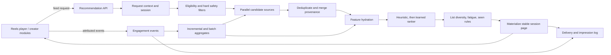

# X-Inspired Recommendation System Plan for Reels and Creator Discovery

Last updated: 2026-09-12

Status: MVP implementation complete; deep automated verification found one release-blocking cursor concurrency defect. Production migration and physical-device verification also remain. The original design remains below; this ledger is the crash-recovery source of truth for execution.

## Implementation progress ledger

Last checkpoint: 2026-09-12 — deep functional and edge-case verification complete. Sequential behavior, adaptive ranking, attribution, migration preservation, and a 1,000-item crawl passed. A deterministic concurrent retry test found that simultaneous requests for the same next-page cursor race on the `(session_id, page_index)` uniqueness constraint: one request succeeds and the losers return HTTP 500 instead of replaying the winning materialized page.

Current milestone: Milestone 4 implementation complete, verification follow-up required — fix concurrent cursor materialization before release, then run database migration and physical Quest validation.

Completed:

- [x] Deep-dive design and phased architecture documented.
- [x] X source snapshots and licensing boundary recorded.
- [x] Existing ECHO event, feed, player, safety, and persistence paths identified.
- [x] Quest documentation pre-flight attempted with `npx -y metavr docs search "Quest Browser video playback pagination media preloading"`.
- [x] Confirmed Meta's CLI cannot run in this environment because its package has no `linux-x64` platform binary.
- [x] Add recommendation/session/attribution schema and migration.
- [x] Add modular candidate generation, ranking, reranking, and session materialization.
- [x] Add stable `GET /api/reels/feed` cursor pagination.
- [x] Extend event contracts with authoritative recommendation attribution, duration/watch ratio, navigation reason, client time, and playback-quality fields.
- [x] Add online actor-item, actor-creator, actor-tag, post-quality, and co-watch aggregate updates.
- [x] Add backend explicit negative-feedback and paginated creator-suggestion endpoints.
- [x] Connect playback/actions and explicit negative-feedback controls to the new attribution contract.
- [x] Convert Reels playback from wrapping a full list to appending bounded pages.
- [x] Add co-watch/content-similarity foundations and creator recommendations.
- [x] Add deterministic backend/frontend tests and run regression suites.
- [x] Add inline-player integration coverage for first-page bootstrap, embedded continuation state, and anonymous cookie propagation.
- [x] Reapply safety, follow, and dismissal exclusions when replaying a materialized creator-suggestion page.
- [x] Preserve deep-linked reel selection while switching subsequent playback to related recommendations.
- [x] Restart stale cursors when the configured algorithm version changes, preventing mixed-version sessions.
- [x] Deep-test complete cursor traversal, cursor tampering and scope mismatch, anonymous-to-auth transitions, idle restart, empty catalogs, invalid surfaces, Following chronology, Related seed pinning, same-session adaptation, attribution spoofing, event idempotency, materialized-page exclusions, and large-catalog pagination.
- [x] Verify legacy engagement-row preservation through `0003 -> 0004 -> 0003` and confirm `alembic check` reports no drift at `0004`.
- [x] Benchmark a full 1,000-item crawl: 42 pages, 1,000 unique posts, approximately 3.8 seconds total in the isolated local test environment (82.8 ms median page, 181.2 ms maximum page).
- [ ] Make simultaneous retries of one cursor idempotent under database concurrency; the current check-then-insert race can return HTTP 500 with `uq_recommendation_request_session_page` violations.
- [ ] Validate playback, pagination, and bounded preload on a physical Quest device.

Active files:

- `docs/x-recommendation-system-plan.md` — design plus this implementation ledger.
- `server/social/models.py`, `server/social/services.py`, `server/social/database.py` — recommendation schema and attributed event aggregation added.
- `server/social/recommendations/` — candidate sources, heuristic ranker, diversity pass, signed cursors, materialized sessions, co-watch, feedback, and creator ranking added.
- `server/routers/social.py` — attributed event fields, feedback API, creator suggestions, and action attribution added.
- `server/routers/reels.py` — feed endpoint, first-page materialization, signed cursor response, and inline-player bootstrap implemented.
- `ui/assets/reels.html`, `web/src/pages/ReelsPage.jsx`, `web/src/components/ui/ReelsPlayer.jsx` — For You defaults, append-only pagination, attribution, negative-feedback controls, and bounded media preloading implemented.
- `tests/test_recommendations.py` — deterministic feed, cursor, attribution, feedback, creator-suggestion, materialized-page safety, and inline-player bootstrap coverage implemented.

Migrations:

- Previous repository head: `20260911_0003`.
- Added additive revision: `20260912_0004_recommendations`.

Validation results:

- Meta documentation CLI: blocked by unsupported `linux-x64`; no guidance was returned.
- Python syntax checks: passed for models, migration, social API, and recommendation modules.
- Backend regression suite: passed (`22 passed`) using dependencies isolated under `/tmp/echo-recommendation-deps`.
- Deep isolated edge matrix: 10 scenarios passed and 1 concurrency scenario failed as expected from the defect below.
- Complete sequential crawl: passed for 56/56 posts with stable absolute positions, no duplicates, and a terminal null cursor.
- Large-catalog crawl: passed for 1,000/1,000 posts over 42 pages; local timing was approximately 3.8 seconds total, 82.8 ms median per page, and 181.2 ms maximum.
- Adaptive ranking: passed; an attributed like changed the next not-yet-materialized page and promoted another post from the liked creator to its first position.
- Attribution defenses: passed for tampered/stolen cursors, anonymous-to-auth cursor reuse, cross-post impression spoofing, cross-actor attribution spoofing, duplicate visibility, and duplicate terminal events.
- Migration preservation: passed; a legacy `engagement_events` row retained all legacy values after upgrade and downgrade, new `playback_quality`/`schema_version` defaults were populated, and `alembic check` found no drift.
- Frontend unit tests: passed (`npm test`).
- Frontend production build: passed (`npm run build`).
- Player JavaScript parse check: passed.
- Alembic upgrade to `20260912_0004`, downgrade to `20260911_0003`, and `alembic check`: passed with no schema drift.

Deep-verification findings requiring follow-up:

1. **Release blocker — concurrent cursor retry race.** `get_reel_page()` first queries for an existing `(session_id, page_index)` request and later inserts one without handling a competing insert. A synchronized four-request test consistently produced one HTTP 200 and three HTTP 500 responses with `UNIQUE constraint failed: recommendation_requests.session_id, recommendation_requests.page_index`. The same check-then-insert shape also exists in creator-page materialization.
2. **Behavior gap — materialized page underfill after a new exclusion.** Retrying an already materialized four-item page after hiding one represented creator correctly removed the unsafe row, but returned three items while retaining the original `has_more` value. Safety is preserved, but the design goal to replace newly ineligible rows without shifting prior positions is not implemented.
3. **Testability/transaction risk — scoped media uses a second global session.** `scoped_media_paths()` opens `SessionLocal` directly instead of using the request's dependency-injected session. Production reads the same database, but tests and uncommitted request-local state can diverge; Following/author tests need a monkeypatch to keep scope reads in the isolated database.

Blockers and constraints:

- Concurrent same-cursor retries must be made idempotent before release.
- Physical Quest verification is unavailable in this environment and remains a release gate.
- Preserve the user's unrelated changes in `docs/vr-reels-playback-investigation.md`.
- Learned ranking remains intentionally gated until enough attributed production interactions exist.

Exact next action: add transaction-safe get-or-create/retry handling for page materialization (Reels and creators), add a permanent concurrent retry regression test, then run `make migrate` in the deployment environment and verify pagination, autoplay/manual navigation, negative feedback, and the next-two preload window on a physical Quest device before release.

Source snapshots reviewed:

- `twitter/the-algorithm` at commit `c54bec0d4e029fe34926ef3258a86ccacc0d0182` (2025-09-03)
- `twitter/the-algorithm-ml` at commit `b85210863f7a94efded0ef5c5ccf4ff42767876c` (2023-04-05)

## Executive decision

ECHO should adopt the architectural ideas in X's public recommendation stack, not copy its service topology or source code.

The recommended design is a modular recommendation pipeline inside the existing FastAPI application:

1. Capture trustworthy, attributable interaction events.
2. Generate candidates from several independent sources.
3. Merge and hydrate candidates with user, post, creator, and context features.
4. Rank first with a transparent heuristic model.
5. Apply hard safety filters and list-level diversity/fatigue rules.
6. Serve stable, cursor-paginated session pages that append to the player.
7. Log every delivered and visible recommendation with its algorithm provenance.
8. Add collaborative filtering, content embeddings, and learned ranking only after the data foundation is healthy.

The same signal and feature layer should later power creator suggestions, but Reels ranking and creator ranking must have separate objectives and policies.

The first production version should remain a modular monolith backed by the existing relational database. X's Kafka, GraphJet, distributed feature stores, ANN services, and model-serving systems solve X-scale problems and would add operational risk here before they add value.

## Goals

- Turn the Discover Reels surface into an effectively infinite, personalized feed.
- Learn from watch behavior and explicit actions without optimizing raw watch time alone.
- Let new interactions affect future, not-yet-served pages in the same session.
- Reuse the signal foundation for related-reel and creator-follow recommendations.
- Preserve blocking, account status, deletion, moderation, and media-availability rules.
- Make every recommendation reproducible enough to debug and evaluate.
- Provide safe fallbacks whenever personalization data or a candidate source is unavailable.

## Non-goals

- Reproducing X's production algorithm exactly. The public repositories are partial and do not include production data, all configurations, or every serving dependency.
- Porting X's microservices, Kafka topology, GraphJet, SimClusters, TwHIN, Navi, or MaskNet directly.
- Training a deep model before ECHO has reliable impression-level data.
- Personalizing explicit user requests such as author, tag, location, search, or saved-content views unless the product later asks for that behavior.
- Ranking advertisements, notifications, or direct messages.
- Inferring sensitive attributes or using precise location for personalization.
- Preloading the entire recommendation queue as media files.

## What X's public code actually discloses

X exposes a recommendation ecosystem rather than one universal ranking function.

| Layer | Publicly disclosed behavior | Lesson for ECHO |
|---|---|---|
| Unified actions | Unified User Actions combines explicit and implicit client/server events into a common stream. | Establish one event contract before building models. |
| User signals | User Signal Service standardizes likes, replies, profile visits, clicks, video views, and related behavior for retrieval and ranking. | Convert raw events into reusable actor-item, actor-creator, and actor-topic features. |
| Candidate generation | Product Mixer and CR-Mixer call several candidate pipelines, merge their output, filter it, and preserve source metadata. | Retrieval must be multi-source; one global SQL sort is not personalization. |
| Collaborative video retrieval | User Video Graph stores recent user-video edges and retrieves related videos through co-engagement graph traversals. | A small co-watch table can provide the same product value without GraphJet. |
| Ranking | The disclosed heavy ranker predicts multiple engagement outcomes and combines them with configurable weights. | Predict or estimate several outcomes; do not optimize only watch time or completion. |
| Filtering and mixing | Seen-content filters, visibility rules, deduplication, source balancing, and result truncation happen outside the core model. | List construction is a separate, first-class stage after scoring. |
| Follow recommendations | FRS has candidate generation, pre-rank filters, ranking, post-rank transforms, validation, social proof, and attribution. | Creator recommendations can reuse the pipeline abstraction while using creator-specific labels and filters. |

### Video-specific findings

- The disclosed User Video Graph is a bipartite user-video graph populated only from `VideoPlayback50` in the shown edge builder.
- Its README says it retains roughly 24–48 hours of in-memory engagement history.
- Related-video lookup samples users who watched a seed video, traverses back to other watched videos, requires minimum query/result degree and co-occurrence, filters old/excluded posts, and ranks with a popularity-normalized log-cosine-style score.
- The implementation rejects sampled users with extremely high graph degree, explicitly noting the spam risk of users who engage with too many items.
- The disclosed Home Recommended pipeline registers multiple sources, including User Video Graph and evergreen video retrieval, then deduplicates, filters previously impressed posts with a Bloom filter, mixes sources, truncates, and records side effects.
- Standalone short-video and semantic-video candidate pipeline classes exist and are feature-gated, but they are not registered in the disclosed `HomeRecommendedTweetsRecommendationPipelineConfig`. Their presence must not be represented as proof that those exact pipelines are active in production.

### Ranking findings

The 2023 ML repository documents a parallel MaskNet with multiple prediction heads and a weighted-sum objective. Its numeric example weights are explicitly dated April 2023 and must not be reused as current or appropriate ECHO weights.

The newer serving repository exposes score features for favorite, reply, repost, downstream conversation and profile engagement, bookmark, share, dwell, video-quality view, immersive video-quality view, quality watch, watch time, and negative feedback.

The serving code obtains weights from runtime configuration. This is the reusable principle: preserve separate outcome estimates and version the policy that combines them.

### Creator-recommendation findings

X's Follow Recommendations Service uses several source families:

- recently engaged creators, including profile visits
- user-user similarity
- expansion from followed or recently engaged accounts
- relationship-strength or RealGraph candidates
- two-hop social-graph traversal and strong-tie prediction
- popular and coarse-geographic candidates
- exploration and source mixing

The documented ML score combines probability of follow with probability of positive engagement after follow. Filters and transforms remove ineligible candidates, deduplicate them, attach social proof, and add attribution tokens.

### What the public repositories do not establish

- They do not provide X's production training data.
- They do not expose all live feature-switch values or current business weights.
- The root repository does not include a complete top-level build setup.
- Some safety code is explicitly removed or incomplete in the public snapshot.
- The ML repository notes that its runnable model may differ from production and supplies random demonstration data.
- A source file's existence does not prove that it is enabled for a given product or current production cohort.

Accordingly, this plan treats the repositories as architectural evidence, not a deployable reference implementation.

## Licensing boundary

`twitter/the-algorithm` is published under AGPL-3.0. The recommended approach is a clean implementation based on general system concepts, this repository's domain model, and independently written interfaces and algorithms. Do not paste or translate X source code into ECHO without a deliberate license review. This is implementation guidance, not legal advice.

## Current ECHO baseline

ECHO already has a useful foundation:

- `Post`, `PostTag`, `PostLike`, `PostSave`, `Follow`, `UserBlock`, comments, reports, and active/deleted status controls.
- `EngagementEvent` records a client event ID, authenticated or anonymous identity, post, event type, source, watch milliseconds, playback position, completion, arbitrary context, and timestamp.
- `/api/events` accepts impression, open, playback, view, complete, skip, search impression/select, and share event types.
- The player emits an impression, a qualified view after 3 seconds for video or 2 seconds for an image, and a terminal complete or skip event.
- `/api/feed` already demonstrates cursor pagination for a chronological feed.
- Reels respects unavailable media and blocked creators before serialization.
- The player preloads the next item and contains a bounded next-two media caching path.

The main gaps are:

- `/api/reels` and `/api/reels/player-inline` build and return the full matching list rather than a page.
- Discover ordering is global. Its current trending formula is `views + likes * 20` and has no per-user component, impression denominator, confidence correction, or time decay.
- The player wraps from the final item to index zero; it does not request or append another page.
- An event cannot be reliably joined to the recommendation request and position that caused it.
- Candidate source, retrieval rank, final rank, algorithm version, experiment assignment, and score explanation are not persisted.
- Duration and watch ratio are not first-class event fields, so short and long videos are not directly comparable.
- Navigation reason, playback errors, buffering, and app/background exits are not separated from genuine negative skips.
- Share initiation from the current player does not consistently emit an attributed recommendation event.
- There is no explicit Not interested or Hide this creator control.
- There are no reusable actor-topic, actor-creator, actor-item, post-quality, or item-similarity aggregates.
- There is no session snapshot that can make cursor retries idempotent and prevent already-served items from moving.

## Target architecture



### Recommended module boundary

Keep the first implementation in-process but express the stages as replaceable modules:

- `RecommendationContext`: actor, surface, scope, seed, filters, session, and exclusions.
- `CandidateSource`: returns candidate IDs, source ranks/scores, seed IDs, and source metadata.
- `FeatureHydrator`: batch-loads candidate and actor-candidate features without N+1 queries.
- `Ranker`: produces a versioned score and score components.
- `ListReranker`: applies diversity, fatigue, source quotas, and exploration.
- `EligibilityFilter`: applies safety, availability, block, dismissal, and seen policies.
- `SessionStore`: materializes pages and makes cursor retries stable.
- `RecommendationLogger`: records requests, delivered candidates, actual impressions, and outcomes.

Each candidate source should have a timeout or query budget and fail open. A failed source must reduce feed richness, not fail the feed. Global trending/fresh content is the final fallback.

## Product surfaces and policies

| Surface | Initial policy | Later policy |
|---|---|---|
| Reels: For You | Personalized, diverse, infinite append | Learned multi-objective ranking |
| Reels: Following | Keep reverse chronological initially | Optional relevance ranking as a separate experiment |
| Related Reels | Seed-post similarity plus safety/diversity | Co-watch and multimodal similarity |
| Creator suggestions | Not in first serving milestone | Shared affinities with creator-specific ranking |
| Search/tag/location/author views | Respect the explicit query and preserve deterministic ordering | Optional ranking only after a separate product decision |

Manual sort selections such as Newest, Most Viewed, Most Liked, or A–Z should remain explicit non-personalized modes. Personalization should be a named For You mode rather than silently changing those semantics.

## Recommendation and attribution contract

Attribution is the prerequisite for any trustworthy ranker. The server, not the client, owns recommendation provenance.

### Identifiers

- `recommendation_session_id`: one browsing session and filter/surface context.
- `recommendation_request_id`: one page-generation request.
- `impression_id`: one returned item at one absolute session position.
- `client_event_id`: existing retry/idempotency identifier for an emitted action.
- `algorithm_version`: immutable code/config version, such as `reels-heuristic-v1.3`.
- `experiment_id` and `variant`: assignment captured at request time.

The response gives the client an opaque `impression_id`. Subsequent events echo only that identifier plus event measurements. The server resolves candidate source, score, rank, version, and experiment from its own record; it must not trust client-supplied provenance or scores.

### Proposed Reels feed endpoint

Preserve `GET /api/reels` as the current browse/catalog endpoint during migration. Add a dedicated feed endpoint:

```text
GET /api/reels/feed
  ?surface=for_you|following|related
  &seed_post_id=<optional>
  &cursor=<opaque optional>
  &limit=12
  &media=all|video|image
```

Existing folder, codec, tag, location, author, and explicit-sort filters may be accepted only for the surfaces where their semantics are defined.

Illustrative response:

```json
{
  "session_id": "rs_...",
  "request_id": "rr_...",
  "algorithm_version": "reels-heuristic-v1",
  "items": [
    {
      "post_id": "...",
      "url": "/media/...",
      "title": "...",
      "creator": {},
      "recommendation": {
        "impression_id": "ri_...",
        "position": 12,
        "reason_key": "similar_to_watched"
      }
    }
  ],
  "next_cursor": "opaque-signed-token",
  "has_more": true
}
```

Raw source scores, internal user features, and sensitive diagnostic details should only be available through an authenticated development/admin trace, never in the normal client response.

### Stable, adaptive pagination

Do not use a simple score/offset cursor. Scores change as events arrive, which creates duplicates, gaps, and reordering.

Use session-page materialization:

1. The first request creates a recommendation session and materializes page zero.
2. Each page stores absolute positions, post IDs, provenance, and algorithm version.
3. Repeating the same cursor returns the same page.
4. A new cursor may rank with the latest interaction state but excludes every item already materialized for the session.
5. Already delivered pages never reorder.
6. A deleted, blocked, or newly ineligible item is rechecked at delivery time and replaced without shifting earlier positions.
7. The opaque signed cursor identifies the session and next page, but does not expose user data or ranking scores.
8. Sessions expire after a configurable idle and maximum lifetime. An expired cursor starts a new session while retaining normal seen-item cooldowns.

This provides both stability and within-session adaptation: a like on item 5 may affect page 2, but cannot move items 1–12 after the client has received them.

### Client queue behavior

- Fetch an initial metadata page, suggested default 12 items.
- Fetch the next metadata page when 3–4 unplayed items remain.
- Append by `post_id`/`impression_id`; never replace the current list wholesale.
- Deduplicate defensively on the client, while treating server duplication as an observable error.
- Stop modulo-wrapping to index zero at the end of the queue. Wait for the next page, retry, show a temporary end state, or use a fallback page.
- Preserve backward navigation within a bounded local history.
- Keep recommendation metadata prefetch separate from media preloading. Continue loading only the next one or two media items until physical-device testing supports a different window.
- Avoid remounting the entire inline player whenever a page arrives; append through a player data API or move queue ownership into the React component.

## Event taxonomy

The event stream should distinguish user preference from playback quality and navigation mechanics.

| Event | Meaning | Recommendation treatment |
|---|---|---|
| `recommendation_delivered` | Server returned an item | Exposure opportunity; server-generated only |
| `impression` | Item became visibly active | Denominator for all rates |
| `playback_start` | Media actually began | Playback diagnostics, weak interest at most |
| `quality_watch` | Crossed a duration-aware quality threshold | Positive implicit signal |
| `watch_end` | Exposure ended with final watch measurements | Main watch label record |
| `complete` | Reached the defined completion threshold or ended | Positive, duration-normalized |
| `replay` | User intentionally replayed or watched another loop | Strong positive, capped |
| `skip` | User manually advanced | Negative only when early and not caused by failure |
| `like` / `unlike` | Explicit preference and reversal | Like positive; unlike normally removes prior credit rather than becoming a strong dislike |
| `save` / `unsave` | Explicit future intent and reversal | Strong positive; reversal removes prior credit |
| `comment` | Authored engagement | Positive, with anti-spam caps |
| `share_initiated` | Opened the share flow | Modest positive |
| `share_sent` | Completed native, link, or in-app share | Strong positive |
| `profile_open` | Opened the creator profile from a recommendation | Creator-affinity signal |
| `follow` / `unfollow` | Creator relationship change | Strong creator signal; rapid unfollow is negative |
| `not_interested` | Explicit item-level negative feedback | Strong suppression for item and related entities |
| `hide_creator` | Explicit creator-level negative feedback | Hard creator suppression for the viewer |
| `report` / `block` | Safety action | Immediate hard exclusion; separate abuse/safety processing |
| `playback_error` | Decode/network/media failure | Quality guardrail; never infer dislike |
| `rebuffer` | Playback stalled | Quality guardrail; discount ambiguous watch/skip labels |

### Required event fields

Retain current fields and add or derive:

- `impression_id`
- `recommendation_request_id`
- `recommendation_session_id`
- `duration_ms`
- `foreground_watch_ms`
- `watch_ratio`, preferably calculated or validated server-side
- `navigation_reason`: swipe next, swipe previous, button next, auto advance, deep link, filter change, page exit, app hidden, playback error
- `media_visible_ratio` and a viewability threshold definition
- `playback_started_at_ms`, startup latency, and rebuffer count/duration where available
- `loop_count`, capped for modeling
- server receive time and client occurrence time

Candidate source, rank, algorithm version, and experiment assignment should be joined through `impression_id`, not accepted as trusted event fields.

### Event semantics

- An impression means the active reel was actually visible, not merely returned by the API or preloaded.
- A terminal `watch_end` should be emitted at most once per exposure and include the final watch metrics and exit reason.
- `complete` should be based on media end or a documented ratio threshold, not only a client boolean.
- A quick manual swipe can be weak negative evidence. A skip caused by decoding failure, buffering, page close, filter change, or backgrounding is neutral for interest.
- Replays and loops must be capped to prevent one item from dominating affinity.
- Duplicate delivery retries and duplicate client events must remain idempotent.
- Existing legacy events remain valid analytics records, but events lacking recommendation attribution should not be treated as clean supervised examples.


## Turning watch behavior into interest

Raw watch milliseconds are biased toward long videos; completion rate is biased toward short videos. Keep both dimensions.

For a video exposure, derive:

```text
watch_ratio = clamp(foreground_watch_ms / duration_ms, 0, 1)
absolute_watch = clamp(log(1 + foreground_watch_ms) / log(1 + 30000), 0, 1)
quality_watch = 0.55 * sqrt(watch_ratio) + 0.45 * absolute_watch
```

The formula is an initial hypothesis, not a permanent product truth. It should be versioned and tuned. The important property is that neither a two-second completion nor a long partial view receives all of the credit.

Use time decay for interests:

```text
decayed_value = event_value * exp(-ln(2) * age / half_life)
```

Maintain two views of preference:

- short-term/session affinity for the last several actions or hours
- long-term affinity over weeks, with slower decay

An illustrative initial event-value policy is:

| Signal | Initial interpretation |
|---|---|
| Quality watch | `+0.5` to `+2.0` based on derived quality |
| Completion | `+1.0`, reduced for extremely short media |
| Intentional replay | `+2.0`, capped |
| Like | `+3.0` |
| Comment | `+3.0`, capped per creator/day |
| Save | `+4.0` |
| Share sent | `+5.0` |
| Profile open | `+1.0` to creator affinity |
| Follow from reel/profile impression | `+6.0` to creator affinity |
| Early manual skip | `-1.0` to `-2.0` when playback was healthy |
| Not interested | `-8.0` plus item/topic suppression |
| Hide creator | hard creator exclusion |
| Report or block | hard exclusion; not merely a ranking penalty |

These numbers must live in versioned configuration, not scattered through route code.

Propagate an item's event value to the item itself, its creator, each normalized tag/topic, and its content cluster when embeddings are introduced. Cap repeated contributions from the same actor, item, or creator per time window to reduce accidental loops and manipulation.

## Candidate generation

Candidate generation should reduce the eligible catalog to a few hundred plausible items before ranking. Each source returns its own ordered list and provenance.

### Initial candidate sources

| Source | Inputs | Purpose | Availability |
|---|---|---|---|
| `following_recent` | Existing follows and post recency | Familiar, high-precision content | Available now |
| `creator_affinity` | Watches/actions grouped by creator | More from creators the actor repeatedly values | Requires aggregate |
| `tag_affinity` | Watches/actions propagated to tags | Topic-based personalization | Requires aggregate; tags already exist |
| `recent_item_related` | Recent positive seed items and item similarity | Continue a viewing theme | Requires co-watch or content similarity |
| `global_quality_trending` | Impressions, quality watches, actions, age | Robust fallback and cold start | Requires impression denominator |
| `fresh_exploration` | Recently published eligible posts | Learn about new items and creators | Available with policy |
| `session_context` | Positive events in current session | Fast adaptation within a session | Requires attributed events |

Later sources include content-embedding nearest neighbors, user/creator similarity, two-hop social expansion, and coarse consented locale trends.

### Source fusion

Raw scores from different sources are not comparable. Merge duplicate posts while retaining every source that proposed them. For the first version use weighted reciprocal-rank fusion:

```text
retrieval_score(post) = sum(source_weight / (rank_constant + rank_within_source))
```

This is stable, understandable, and avoids pretending that a co-watch similarity and a trending score share a scale. Add a small multi-source agreement feature, but cap it so popularity sources cannot overwhelm personal sources.

Source weights and per-source fetch limits must be configuration values with an algorithm version. Starting values should be validated in shadow mode rather than treated as fixed requirements.

### Co-watch similarity

Implement the product idea behind X's User Video Graph with a relational aggregate first:

1. Define a qualified positive watch, initially requiring both a minimum foreground watch and a minimum ratio.
2. For each actor/day, deduplicate qualifying posts and cap the number of posts contributing pairs.
3. Generate item pairs from a rolling interaction window.
4. Count unique co-viewers rather than raw event count.
5. Drop pairs below a minimum support threshold.
6. Normalize popularity, for example:

```text
similarity(i, j) = co_viewers(i, j) / sqrt(viewers(i) * viewers(j))
                   * co_viewers(i, j) / (co_viewers(i, j) + shrinkage)
```

7. Store only the top related items per source item and model/version.

Use the actor's most recent strong positive items as seeds. Exclude negative, already served, unavailable, blocked, and same-item candidates. When the graph is sparse, fall back to tag/content similarity and trending rather than lowering safety or quality thresholds indefinitely.

### Trending and quality

Replace `views + likes * 20` for recommendation purposes. A useful initial quality score needs:

- impression count as denominator
- qualified-watch rate
- completion rate normalized by duration bucket
- save/share/like rates
- negative-feedback and report rates
- Bayesian shrinkage toward the catalog average for low-volume posts
- time decay

Popularity should be a candidate source and quality feature, not the complete personalized ranker.

### Content similarity

Introduce content retrieval progressively:

1. Exact normalized tags.
2. TF-IDF or another lightweight text representation over title, caption, and tags.
3. Versioned semantic text embeddings.
4. Optional visual/video embeddings generated asynchronously from representative frames.

Store the embedding model version and regenerate indexes independently of the online API. Do not block post publication or feed requests on embedding generation; content without an embedding remains eligible through other sources.

## Eligibility and safety

Hard eligibility runs before expensive ranking and again before a materialized item is delivered.

For Reels, remove:

- unpublished, deleted, missing, or incompatible media
- inactive or unavailable creators
- either-direction blocked relationships
- posts or creators explicitly hidden by the viewer
- posts reported by the viewer, subject to the existing reporting policy
- duplicate post IDs and duplicate media hashes
- items inside the configured seen cooldown
- candidates that violate moderation or surface policy

For creator suggestions, additionally remove the current user, already-followed creators, dismissed suggestions within the dismissal window, and creators with no eligible recent content when the surface promises active creators.

Safety exclusions cannot be offset by a high rank score. Any materialized session item must be revalidated because status and block state can change after ranking.

## Heuristic ranker v1

Start with a transparent ranker over normalized `[0, 1]` features. An illustrative structure is:

```text
base_score =
    1.00 * retrieval_fusion
  + 1.50 * creator_affinity
  + 1.25 * topic_affinity
  + 1.00 * co_watch_similarity
  + 0.70 * bayesian_quality
  + 0.50 * freshness
  + 0.35 * exploration_value
  - 1.50 * recent_quick_skip_affinity
  - 1.00 * exposure_fatigue
```

Do not commit these numbers as universal truths. Their purpose is to establish a debuggable baseline. Every scored candidate should have a structured server-side breakdown. Normal responses receive only a coarse reason key such as `from_creator_you_watch`, `similar_to_watched`, `topic_you_watch`, `popular_now`, or `new_creator`.

## List-level reranking

The highest independent scores do not necessarily form the best feed. Apply a greedy list reranker after base scoring.

Recommended initial constraints for a 12-item page:

- no consecutive posts from the same creator
- no more than three posts from one creator
- cap a dominant tag/topic cluster
- suppress exact and near-duplicate media
- include at least one eligible exploration item when supply permits
- cap any one candidate source's share of the page
- penalize similarity to the last few selected items
- honor seen, not-interested, creator-hide, and report cooldowns

Use maximum marginal relevance or an equivalent greedy adjustment:

```text
next_score = base_score
             - similarity_to_selected_penalty
             - creator_fatigue
             - topic_fatigue
             + unmet_source_or_exploration_bonus
```

All caps should be configurable by surface. A related-reels surface may intentionally allow tighter topic similarity than the general For You feed.

## Cold start and exploration

### New or anonymous actor

- Start with quality-adjusted trending, fresh content, and strong diversity.
- Use current-session actions immediately for later pages.
- Use the existing anonymous cookie only under a documented retention and consent policy.
- Do not silently merge anonymous history into an account until that product/privacy behavior is approved.
- Optional onboarding topic choices can accelerate cold start later, but are not required for v1.

### New post or creator

- Reserve a small configurable exploration budget rather than requiring prior engagement.
- Apply baseline safety and media-quality gates first.
- Give the item limited, distributed impressions; expand only when quality-watch and negative-feedback evidence is healthy.
- Cap the influence of a single actor and avoid rewarding coordinated repeated actions.

A small randomized safe-candidate bucket is important for learning because a purely deterministic ranker observes feedback only on what it already prefers. Log the selection probability or experiment bucket so future offline evaluation can account for exposure bias.

## Creator follow recommendations

Creator recommendations should use the same pipeline primitives but a different candidate type and objective.

### Candidate sources

- creators with repeated quality watches or positive actions who are not yet followed
- creators similar in tag/content distribution to followed or high-affinity creators
- creators surfaced by co-watch relationships
- creators followed by strong existing relationships or mutual follows
- active, quality-adjusted popular creators for cold start
- new-creator exploration

Address-book import should not be added merely because X uses it; ECHO does not currently need that privacy and operational surface.

### Creator features

- duration-normalized watch quality across the creator's posts
- number of distinct positively engaged posts and distinct active days
- likes, saves, shares, comments, and profile opens
- recent negative skips, not-interested actions, reports, blocks, or prior dismissal
- tag/content overlap with the viewer's interests
- mutual-follow or two-hop social proof
- creator activity, eligible-post count, quality priors, and recent moderation state
- exposure count and time since the creator was last suggested

### Objective

The long-term target should resemble:

```text
creator_score =
    P(follow from recommendation)
  + alpha * P(positive reel engagement within 7 days after follow)
  - beta  * P(rapid unfollow, hide, block, or report)
```

Before there is sufficient data, implement this as a versioned heuristic using creator affinity, social proximity, content overlap, quality, recency, and fatigue.

Attach social proof and a reason after final selection. Every creator card needs its own impression ID so follows, dismissals, and downstream engagement can be attributed to the correct module and rank.

## Proposed logical data model

Exact migrations should be designed during implementation. The logical entities are:

### `recommendation_sessions`

- session ID
- authenticated or anonymous actor reference
- surface and normalized filter hash
- algorithm/config version and experiment variant
- created, last-accessed, and expiry timestamps
- status and restart reason

### `recommendation_requests`

- request ID and session ID
- page number or cursor sequence
- requested and returned counts
- source timings, fallback reason, and total latency
- actor-feature snapshot/version
- created timestamp

### `recommendation_impressions`

One row per item returned by a request, even if it never becomes visible:

- impression ID, request ID, session ID
- absolute position and post or creator ID
- primary source and all contributing sources
- source ranks/scores and final score, preferably compact/versioned
- reason key
- delivered timestamp and nullable first-visible timestamp
- unique `(session_id, absolute_position)` and `(session_id, item_id)` constraints

This table also provides the stable materialized session queue. A client `impression` event marks visibility; delivery alone must not count as an impression metric.

### `engagement_events` additions

- nullable impression/request/session foreign keys
- duration and foreground-watch fields
- navigation reason
- playback quality fields
- client occurrence timestamp
- event schema version

Keep `client_event_id` uniqueness. Add indexes for actor/time, post/event/time, and impression ID. Preserve current fields for compatibility.

### Aggregate tables

- actor-item interaction summary
- actor-creator affinity
- actor-tag/topic affinity
- post quality and freshness features
- item-item similarity by method and model version
- creator-creator similarity when needed
- explicit item/creator dismissals and expiry policy

Aggregates need `updated_at`, source-window boundaries, and calculation version. They must be rebuildable from retained source events where policy permits.

### Media features

Recommendation quality requires authoritative post media metadata, at minimum duration, width, height, aspect ratio, media type, codec compatibility, a stable media fingerprint, and optional text/visual embedding IDs and versions.

Duration should be captured during media processing or backfilled with the existing probe utilities, not trusted only from the browser.

## Computation strategy at ECHO scale

### Online path

- Read the materialized long-term actor profile.
- Overlay a small number of recent raw/session events for immediate adaptation.
- Run bounded candidate queries.
- Batch-hydrate features.
- Score and rerank a few hundred candidates.
- Materialize one page transactionally.
- Return a fallback page if personalization times out.

### Background path

- Incremental actor-item, actor-creator, and actor-tag updates every few minutes or through a durable worker.
- Trending/post-quality refresh hourly or at another measured cadence.
- Co-watch similarity rebuild on a rolling window daily at first.
- Content features on post publication plus repair/backfill jobs.
- Training datasets and models only after attribution quality is proven.

The current in-process job executor is appropriate for local media tasks, but durable recommendation aggregates should eventually run through a process that survives application restarts. A scheduled management command is sufficient initially; a queue system is not required on day one.

### Storage evolution

SQLite with WAL can support development and a small single-instance rollout if queries are indexed and writes are batched. Move the social/recommendation data path to PostgreSQL when measured lock contention, event volume, concurrent writers, or latency SLOs justify it. Add Redis only if ephemeral session/candidate caching becomes a demonstrated bottleneck.

Do not make the first implementation depend on a distributed graph database or vector database. Hide storage behind candidate-source interfaces so those can be introduced later without changing the feed contract.

## Learned ranking roadmap

Do not begin this phase until ECHO has enough attributable impressions, positive outcomes, and negative feedback to form stable train/validation sets.

### Training examples

- One example per actually visible recommendation impression.
- Join only features available at recommendation time.
- Define label windows per outcome.
- Treat an unengaged impression as censored until its label window closes.
- Separate playback failures from preference negatives.
- Preserve source, rank, surface, experiment, and selection probability.
- Use temporal holdouts and point-in-time-correct feature joins to prevent leakage.

### First learned model

A gradient-boosted tree or calibrated logistic model is preferable to a deep network at ECHO's initial data scale. Predict separate outcomes:

- quality watch
- completion
- like
- save
- share
- profile open
- follow
- explicit negative feedback

Combine calibrated probabilities through a versioned utility policy. Negative-feedback predictions should have substantial influence, and reports/blocks remain hard policy actions rather than merely model targets.

Only consider neural multi-task ranking when simpler models are data-limited rather than architecture-limited.

### Bias controls

- Maintain a small randomized exploration cohort over already-safe candidates.
- Log propensities or at least exact randomized policy/version assignments.
- Do not train only on clicks/likes; include exposed non-actions and watch outcomes.
- Cap high-frequency users and creators in training.
- Report metrics by new/existing user, catalog head/tail, creator size, media duration, and surface.

## Evaluation

### Data-quality gates

- At least 99% of recommendation interaction events join to a valid impression in controlled testing.
- Duplicate client event IDs do not create duplicate rows or counters.
- Delivered, visible, playback-start, and terminal-watch counts form a coherent funnel.
- Duration and watch ratio pass range and consistency checks.
- Playback failures are distinguishable from manual skips.
- Source, algorithm version, rank, and experiment are present for every delivered recommendation.

### Offline retrieval metrics

- candidate recall@K for the actor's next strong positive interaction
- source-level recall and overlap
- pool fill rate and latency
- unseen catalog and creator coverage
- fallback rate
- blocked/ineligible leakage, which must be zero

### Offline ranking metrics

- NDCG@K or MAP for graded engagement utility
- per-head ROC-AUC/PR-AUC where meaningful
- probability calibration
- negative-feedback recall
- diversity and creator concentration
- performance by duration and user-history bucket

Offline metrics are directional. Historical logs reflect the previous policy and cannot by themselves establish product improvement.

### Online primary metrics

- quality watches per 100 visible impressions
- saves, shares, follows, and other meaningful actions per 100 impressions
- satisfied session depth, defined without counting loops or failed playback
- retained creator follows with positive downstream engagement

### Guardrails

- quick-skip rate
- Not interested, hide creator, report, block, and rapid-unfollow rates
- playback startup time, rebuffering, decode errors, and failed-next-page rate
- p50/p95 feed response latency and source timeout rate
- duplicate and repeat-view rate
- creator and topic concentration
- new-content exposure and catalog coverage
- event loss and attribution join rate

Use staged experiments with automatic rollback criteria. Never expose unsafe candidates as part of exploration.

## Privacy, deletion, and abuse resistance

- Document why each signal is collected and how long raw events, delivery rows, sessions, and aggregates are retained.
- Use shorter retention for anonymous activity and expose a Clear personalization control before long-lived anonymous profiling.
- On account deletion, delete or irreversibly anonymize recommendation sessions, delivery rows, affinities, and training examples in addition to the current event anonymization.
- Allow users to reset interests and inspect or control major inferred topics when the feature matures.
- Do not use precise location. Any coarse-location source should be opt-in and separately reviewed.
- Validate watch fields against server-known duration, clamp impossible values, and reject unknown impression IDs.
- Rate-limit events and cap repeated contribution by actor/item/day.
- Require valid delivery provenance before an event influences recommendation training.
- Detect coordinated engagement, impossible event cadence, and extremely high-degree actors before constructing co-watch pairs.
- Keep moderation and block state authoritative at read time.
- Avoid logging full feature vectors or raw private context in application logs.

## Failure behavior

- Candidate-source timeout: continue with remaining sources.
- Missing/stale actor profile: use recent events plus cold-start sources.
- Aggregate job lag: expose freshness metrics and fall back; do not block feed availability.
- Ranker error: serve safety-filtered quality/trending order.
- Invalid or expired cursor: return a typed restart response or create a new session; never silently reuse an unrelated session.
- Concurrent requests for one cursor: transactionally return the same materialized page.
- Deleted or newly blocked materialized post: skip and refill from eligible candidates.
- Exhausted personalized pool: broaden to safe trending/fresh candidates with deduplication.
- Next-page network error: retain the current queue and retry with backoff; do not wrap to item zero.

## Observability and debugging

Track per algorithm version, surface, and experiment:

- request volume, latency, errors, and fallback reason
- candidate count and latency by source
- pre- and post-filter counts by reason
- source overlap and source contribution to served positions
- score and feature distributions
- page fill rate and duplicate suppression
- impression and terminal-event join rates
- aggregate freshness
- exploration allocation
- creator/topic concentration
- playback-quality metrics independently from interest metrics

Add an admin-only recommendation trace that answers:

- Why was this item eligible?
- Which sources produced it and from which seeds?
- Which filters were applied?
- What were the normalized feature contributions?
- Which diversity rule moved or removed it?
- Which algorithm and experiment version served it?

Never expose other users' identities from co-watch or social-proof calculations.

## Phased implementation roadmap

No phase below is implemented by this document.

### Phase 0 — Product, metric, and privacy contract

Deliverables:

- Decide which surface is the personalized default.
- Define quality watch, completion, early skip, satisfied session, and creator follow quality.
- Approve raw-event, anonymous-history, impression, and aggregate retention.
- Approve explicit Not interested, Hide creator, and Reset personalization behaviors.
- Establish algorithm-version and experiment naming.

Exit gate:

- Product, engineering, safety, and privacy stakeholders agree on the event semantics and success/guardrail metrics.

### Phase 1 — Attribution and event correctness

Planned work:

- Add recommendation request/session/impression persistence.
- Extend events with impression attribution, duration, navigation reason, and playback quality.
- Emit one visible impression and one terminal watch record per exposure.
- Add attributed share, profile-open, follow, Not interested, and Hide creator events.
- Make server-known provenance authoritative and preserve client-event idempotency.
- Backfill post duration and media fingerprints.
- Add data-quality dashboards or queries.

Exit gate:

- Controlled test sessions meet the attribution, idempotency, and event-funnel quality gates. Ranking behavior is still unchanged.

### Phase 2 — Stable infinite-scroll transport

Planned work:

- Add `/api/reels/feed` with opaque session cursors.
- Initially materialize the existing safe chronological/trending order, not personalization.
- Change the player from a static full-list payload to an appendable queue.
- Fetch metadata near queue exhaustion and retain bounded media preloading.
- Stop automatic wraparound to index zero.
- Handle cursor retry, expiry, deletion, block changes, and empty/fallback pages.

Exit gate:

- Long-session browser tests show no duplicates, gaps, reorder of delivered items, runaway media preload, or unrecoverable next-page failures.

### Phase 3 — Heuristic personalization in shadow mode, then rollout

Planned work:

- Build actor-item, actor-creator, actor-tag, and post-quality aggregates.
- Implement candidate-source, feature, ranker, filter, and reranker interfaces.
- Launch following-recent, creator-affinity, tag-affinity, trending, fresh-exploration, and session-context sources.
- Compute recommendations in shadow mode while serving the Phase 2 baseline.
- Compare candidate recall, diversity, latency, safety exclusions, and score behavior.
- Roll out behind a feature flag with automatic fallback.

Exit gate:

- Shadow metrics are healthy, block/safety leakage is zero, latency is inside the agreed budget, and a staged online experiment improves a primary metric without guardrail regression.

### Phase 4 — Collaborative and content retrieval

Planned work:

- Build rolling co-watch item similarity with support thresholds, shrinkage, and high-degree-actor caps.
- Add seed-based related Reels through the same pipeline.
- Add text/tag similarity, then versioned semantic or visual embeddings if justified.
- Add near-duplicate media filtering.

Exit gate:

- New sources add unique held-out recall and online value rather than only duplicating trending results.

### Phase 5 — Creator follow suggestions

Planned work:

- Build creator candidate sources from affinities, content similarity, social graph, co-watch, popularity, and exploration.
- Add creator-specific dismissals, cooldowns, filters, attribution, and social proof.
- Launch a heuristic creator ranker and measure follow plus downstream 7-day engagement quality.
- Reuse the shared orchestration and logging layers, not the Reels item score itself.

Exit gate:

- Follow conversion and retained-follow quality improve without increased rapid unfollow, hide, block, or report rates.

### Phase 6 — Learned multi-objective ranking

Planned work:

- Build point-in-time-correct training examples from attributed impressions.
- Train and calibrate simple per-outcome models first.
- Combine outputs through a versioned utility policy.
- Run offline replay, shadow scoring, and staged online experiments.
- Consider neural or embedding-heavy ranking only if data and measured limitations justify it.

Exit gate:

- The learned policy beats the heuristic online and has acceptable calibration, latency, explainability, and safety guardrails.

## Proposed implementation touchpoints

When implementation begins, the likely change map is:

- `migrations/versions/`: additive recommendation/event migration first.
- `server/social/models.py`: attribution, session, delivery, aggregate, and dismissal models.
- `server/social/services.py`: shared event validation and aggregate helpers.
- `server/social/recommendations/`: new package for context, candidate sources, features, ranking, reranking, sessions, and tracing.
- `server/routers/reels.py`: retain browse behavior; add or delegate the cursor feed endpoint.
- `server/routers/social.py`: evolve the event contract and explicit feedback endpoints.
- `ui/assets/reels.html`: event state machine, append queue, no-wrap behavior, explicit negative controls, and bounded media preload.
- `web/src/components/ui/ReelsPlayer.jsx`: own or bridge paginated queue state without remounting the player.
- `web/src/pages/ReelsPage.jsx`: expose a distinct For You mode while preserving manual filters and sorts.
- `tests/test_recommendations.py`: deterministic source, scoring, filtering, session, cursor, event, and privacy tests.
- Browser/end-to-end tests: infinite append, event attribution, retries, and interaction feedback.

## First implementation slice

The safest first coding milestone is deliberately non-personalized:

1. Add request/session/impression IDs and event semantics.
2. Add the cursor feed using the current eligible order.
3. Convert the player to append pages and stop wrapping.
4. Add Not interested and Hide creator controls, initially as hard suppressions.
5. Verify attribution and long-session behavior.
6. Only then compute heuristic recommendations in shadow mode.

This sequence prevents a ranker from being trained or judged on ambiguous telemetry and separates feed transport bugs from recommendation-quality bugs.

## Recommended default decisions

| Decision | Recommended starting choice |
|---|---|
| Personalized surface | Discover/For You only |
| Following feed | Reverse chronological initially |
| Metadata page size | 12 items, configurable |
| Next-page trigger | 3–4 remaining items |
| Media preload | Next 1–2 items pending device validation |
| Page stability | Materialize each page once; adapt only future pages |
| Exploration | Small configurable safe-candidate allocation |
| Explicit negatives | Hard suppression for creator hide/block; strong item/topic suppression for Not interested |
| Anonymous profile | Short-lived and isolated until consent/merge policy is approved |
| Ranking model | Versioned heuristic before ML |
| Initial similarity | Tags and relational co-watch before vector infrastructure |
| Failure fallback | Safety-filtered quality/trending plus fresh content |
| Debugging | Server-side trace with coarse client-facing reason keys |

## Open decisions before implementation

- Should image reels and video reels share one objective or separate duration/quality policies?
- What exact visibility threshold constitutes an impression in the embedded and fullscreen players?
- What retention periods are acceptable for authenticated and anonymous recommendation history?
- Should a login optionally merge the current anonymous session into the new account?
- Should followed-creator content ever be mixed into For You, or remain isolated to Following?
- Which explicit negative controls are item-only versus creator-wide?
- Is coarse location allowed for candidate generation, and under what consent?
- What are the target latency and database-write budgets on the intended deployment hardware?
- Which minimum support threshold makes co-watch useful without leaking or overfitting sparse behavior?
- At what traffic/data threshold is ML evaluation statistically meaningful?
- How should users reset or inspect inferred interests?

## Quest playback validation note

The recommendation design is platform-neutral. An attempted authoritative Meta documentation lookup through the required `metavr` tool could not run because the published CLI does not support this environment's `linux-x64` platform. Therefore this document makes no new Quest API or device-capacity claims.

Before release, test the completed paginated player on each supported physical headset/browser combination. Validate a long swipe session, memory growth, media-cache eviction, startup time, rebuffering, next-page fetch concurrency, fullscreen/WebXR transitions, and controller navigation. Metadata prefetch must not accidentally trigger unbounded media downloads. Preserve the current bounded next-item behavior until measurements justify changing it.

## Source references

- [X recommendation repository overview](https://github.com/twitter/the-algorithm/blob/c54bec0d4e029fe34926ef3258a86ccacc0d0182/README.md)
- [Retrieval signals](https://github.com/twitter/the-algorithm/blob/c54bec0d4e029fe34926ef3258a86ccacc0d0182/RETREIVAL_SIGNALS.md)
- [Unified User Actions](https://github.com/twitter/the-algorithm/blob/c54bec0d4e029fe34926ef3258a86ccacc0d0182/unified_user_actions/README.md)
- [User Signal Service](https://github.com/twitter/the-algorithm/blob/c54bec0d4e029fe34926ef3258a86ccacc0d0182/user-signal-service/README.md)
- [Product Mixer](https://github.com/twitter/the-algorithm/blob/c54bec0d4e029fe34926ef3258a86ccacc0d0182/product-mixer/README.md)
- [CR-Mixer](https://github.com/twitter/the-algorithm/blob/c54bec0d4e029fe34926ef3258a86ccacc0d0182/cr-mixer/README.md)
- [User Video Graph overview](https://github.com/twitter/the-algorithm/blob/c54bec0d4e029fe34926ef3258a86ccacc0d0182/src/scala/com/twitter/recos/user_video_graph/README.md)
- [User Video Graph 50% playback edge builder](https://github.com/twitter/the-algorithm/blob/c54bec0d4e029fe34926ef3258a86ccacc0d0182/recos-injector/server/src/main/scala/com/twitter/recosinjector/edges/UnifiedUserActionToUserVideoGraphBuilder.scala)
- [Related-video graph traversal](https://github.com/twitter/the-algorithm/blob/c54bec0d4e029fe34926ef3258a86ccacc0d0182/src/scala/com/twitter/recos/user_video_graph/relatedTweetHandlers/TweetBasedRelatedTweetsHandler.scala)
- [Related-video popularity-normalized scoring](https://github.com/twitter/the-algorithm/blob/c54bec0d4e029fe34926ef3258a86ccacc0d0182/src/scala/com/twitter/recos/user_video_graph/util/GetRelatedTweetCandidatesUtil.scala)
- [Disclosed Home Recommended candidate pipeline](https://github.com/twitter/the-algorithm/blob/c54bec0d4e029fe34926ef3258a86ccacc0d0182/tweet-mixer/server/src/main/scala/com/twitter/tweet_mixer/product/home_recommended_tweets/HomeRecommendedTweetsRecommendationPipelineConfig.scala)
- [Current disclosed predicted-score features](https://github.com/twitter/the-algorithm/blob/c54bec0d4e029fe34926ef3258a86ccacc0d0182/home-mixer/server/src/main/scala/com/twitter/home_mixer/model/PredictedScoreFeature.scala)
- [2023 heavy-ranker documentation](https://github.com/twitter/the-algorithm-ml/blob/b85210863f7a94efded0ef5c5ccf4ff42767876c/projects/home/recap/README.md)
- [Follow Recommendations Service](https://github.com/twitter/the-algorithm/blob/c54bec0d4e029fe34926ef3258a86ccacc0d0182/follow-recommendations-service/README.md)
- [Follow recommendation flow](https://github.com/twitter/the-algorithm/blob/c54bec0d4e029fe34926ef3258a86ccacc0d0182/follow-recommendations-service/common/src/main/scala/com/twitter/follow_recommendations/common/base/RecommendationFlow.scala)
- [Recent-engagement creator source](https://github.com/twitter/the-algorithm/blob/c54bec0d4e029fe34926ef3258a86ccacc0d0182/follow-recommendations-service/common/src/main/scala/com/twitter/follow_recommendations/common/candidate_sources/recent_engagement/README.md)
- [User similarity source](https://github.com/twitter/the-algorithm/blob/c54bec0d4e029fe34926ef3258a86ccacc0d0182/follow-recommendations-service/common/src/main/scala/com/twitter/follow_recommendations/common/candidate_sources/sims/README.md)
- [Two-hop random-walk source](https://github.com/twitter/the-algorithm/blob/c54bec0d4e029fe34926ef3258a86ccacc0d0182/follow-recommendations-service/common/src/main/scala/com/twitter/follow_recommendations/common/candidate_sources/two_hop_random_walk/README.md)
- [Visibility filtering overview and disclosure caveat](https://github.com/twitter/the-algorithm/blob/c54bec0d4e029fe34926ef3258a86ccacc0d0182/visibilitylib/README.md)
- [AGPL-3.0 license](https://github.com/twitter/the-algorithm/blob/c54bec0d4e029fe34926ef3258a86ccacc0d0182/COPYING)
